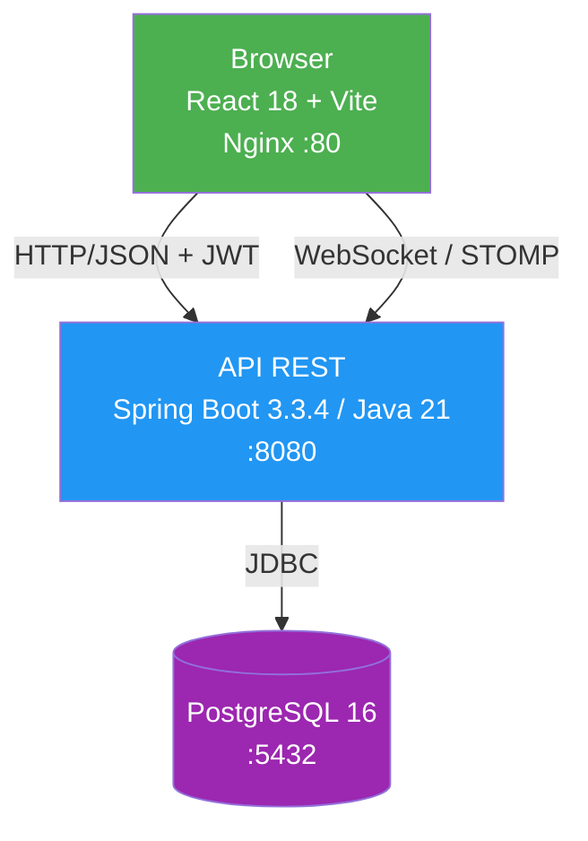

# 01 — Contexto del sistema · NEVI

## Descripción del sistema

**NEVI** es una plataforma educativa que conecta estudiantes y profesores
en un entorno de aprendizaje colaborativo. Los estudiantes acceden a
contenido académico, participan en chats en tiempo real y reciben
retroalimentación; los profesores gestionan cursos y se comunican
directamente con sus estudiantes.

El sistema se compone de un frontend web SPA y una API REST independiente
respaldada por PostgreSQL, comunicados también mediante WebSocket para
mensajería en tiempo real.

## Stack tecnológico

| Capa | Tecnología | Versión | Puerto |
|---|---|---|---|
| Frontend | React 18 + Vite + Tailwind CSS | 18 / Vite 5 | 80 (Nginx) |
| API REST | Spring Boot (Java) | 3.3.4 / Java 21 | 8080 |
| Base de datos | PostgreSQL | 16 | 5432 |
| Mensajería RT | WebSocket + STOMP + SockJS | — | 8080 |
| Autenticación | JWT en `localStorage` (`nevi_token`) | — | — |
| Contenerización | Docker Compose | — | — |

## Instrucciones de ejecución reproducible

El sistema arranca con **dos comandos** desde la raíz del repositorio:

```bash
git clone https://github.com/pinzon0930-boop/NEVI.git
cd NEVI
docker-compose up --build
```

Verificación de servicios:

| Servicio | URL | Resultado esperado |
|---|---|---|
| Frontend | `http://localhost` | Página de login de NEVI |
| API health | `http://localhost:8080/api/auth/login` | HTTP 400 (endpoint activo) |
| Base de datos | Puerto 5432 | Aceptando conexiones |

## Topología de despliegue



## Criterios de aceptabilidad operativa

| Criterio | Valor objetivo | Fuente |
|---|---|---|
| Frontend accesible tras `docker-compose up` | HTTP 200 en `localhost` | Nginx |
| Login devuelve token JWT | HTTP 200 + `token` en respuesta | `AuthController` |
| WebSocket conecta correctamente | Sin errores de STOMP en consola | `SockJS` |

## Decisiones heredadas del sistema base

| Decisión | Razón | Consecuencia |
|---|---|---|
| JWT en `localStorage` (`nevi_token`) | Simplicidad de implementación inicial | Superficie XSS activa — identificado como R-02 |
| `ddl-auto: update` en JPA | Facilita desarrollo rápido | Riesgo de corrupción de esquema en producción (R-03) |
| CORS `allowed-origins: "*"` | Evitar bloqueos en desarrollo local | Acepta peticiones de cualquier origen (R-05) |
| WebSocket / STOMP sobre SockJS | Chat en tiempo real sin polling | Requiere sesión autenticada para conectar |
