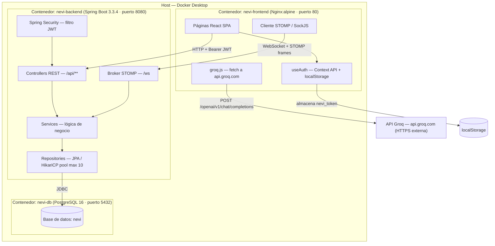

# 01 · Contexto del Sistema Base — NEVI

**Estado:** Semana 1 · Hito 1 y 3  
**Fecha de adopción:** 2026-09-11  
**Protocolo de adopción:** Opción A — Producto Propio (asignatura predecesora)

---

## 1. Descripción del Sistema

NEVI es una plataforma educativa en tiempo real que conecta profesores y estudiantes mediante grupos de trabajo, actividades pedagógicas y un chat colaborativo con asistencia de inteligencia artificial.

**Propósito de negocio:** Facilitar la gestión de actividades académicas y la comunicación sincrónica dentro de grupos educativos, con apoyo de IA generativa para la creación de quizzes, rúbricas y retroalimentación.

---

## 2. Stack Tecnológico Declarado

| Capa | Tecnología | Versión declarada en el repositorio |
|---|---|---|
| Frontend | React + Vite + Tailwind CSS | React 18, Vite 5 |
| Backend | Spring Boot / Java | Spring Boot 3.3.4, Java 21 |
| Persistencia | PostgreSQL | 16 (imagen Docker oficial) |
| Mensajería RT | WebSocket / STOMP sobre SockJS | Spring WebSocket |
| Autenticación | JWT (firmado con HS256) | Almacenado en `localStorage` |
| IA generativa | API Groq (modelo `openai/gpt-oss-20b`) | Sin versión fija declarada |
| Orquestación | Docker Compose | 3 servicios: `db`, `backend`, `frontend` |

> **Fuente:** `backend/pom.xml`, `frontend/package.json`, `docker-compose.yml`

---

## 3. Instrucciones Reproducibles de Ejecución (2 comandos)

**Prerrequisito:** Docker Desktop corriendo en el host.

```bash
# Comando 1 — Clonar el repositorio del sistema
git clone https://github.com/pinzon0930-boop/NEVI.git && cd NEVI

# Comando 2 — Levantar los tres servicios
docker-compose up --build
```

**Verificación de que el sistema levantó correctamente:**

| Servicio | URL / Puerto | Señal de éxito |
|---|---|---|
| Frontend (Nginx) | http://localhost:80 | Pantalla de login visible |
| Backend (Spring Boot) | http://localhost:8080 | `{"status":"UP"}` en `/actuator/health` |
| PostgreSQL | `localhost:5432` | Contenedor `nevi-db` en estado `healthy` |

> **Nota sobre la IA:** Para activar las funciones de IA (quiz, rúbrica, retroalimentación), crear un archivo `.env` en la raíz del proyecto con `VITE_GROQ_API_KEY=gsk_...` antes de ejecutar `docker-compose up --build`.

---

## 4. Topología de Componentes



---

## 5. Criterios de Aceptabilidad del Sistema Base (verificados)

| Criterio | Estado | Evidencia |
|---|---|---|
| Ejecución local determinista | ✅ Cumple | `docker-compose up --build` levanta los 3 servicios en cualquier máquina con Docker |
| Persistencia real | ✅ Cumple | PostgreSQL 16 en contenedor con volumen `postgres_data` declarado en `docker-compose.yml` |
| Suite de pruebas de control | ⚠️ Pendiente | No existe ninguna clase en `backend/src/test/` — riesgo registrado en `03-inventario-riesgos.md` |
| Alcance abarcable | ✅ Cumple | 4 entidades principales: `User`, `Grupo`, `Actividad`, `Mensaje` — comprensibles en < 2 semanas |

---

## 6. Decisiones Heredadas (no reversibles en esta iteración)

Estas decisiones fueron tomadas en la asignatura predecesora y constituyen restricciones insalvables para el módulo actual:

- **JWT en `localStorage`:** expuesto a XSS; no se migrará a `HttpOnly` cookie en Semana 1-2.
- **`ddl-auto: update`:** Hibernate modifica el esquema automáticamente; no hay Flyway/Liquibase.
- **`allowed-origins: "*"`:** CORS abierto a todos los orígenes; inaceptable en producción.
- **Sin health check en Docker Compose:** ningún servicio declara `healthcheck`; fallos de BD no reinician el backend.
