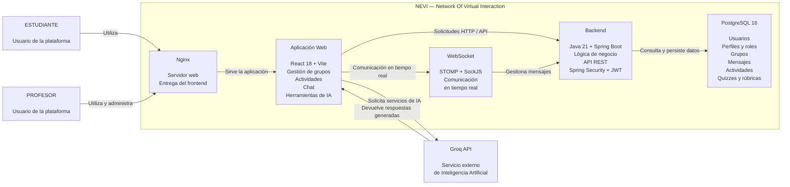

# C4 Nivel 2 — Modelo de Contenedores de NEVI

## 1. Objetivo

El modelo C4 Nivel 2 presenta los principales contenedores que conforman el sistema **NEVI (Network Of Virtual Interaction)** y muestra cómo se relacionan entre sí, con los usuarios y con los servicios externos utilizados por la plataforma.

Esta vista permite pasar del contexto general del sistema presentado en el Nivel 1 a una descripción de las principales unidades tecnológicas que implementan las funcionalidades de comunicación, gestión académica e inteligencia artificial de NEVI.

La representación corresponde al estado actual de la solución implementada en el repositorio y no a una arquitectura futura propuesta.

---

## 2. Propósito de la vista

El propósito de esta vista es identificar las unidades principales que conforman la solución tecnológica actual de NEVI y las responsabilidades asociadas a cada una.

La vista permite comprender cómo la interfaz web se comunica con el backend, cómo el backend gestiona la autenticación y el acceso a la información almacenada en PostgreSQL, cómo se establece la comunicación en tiempo real mediante WebSocket y cómo se utilizan los servicios externos de inteligencia artificial proporcionados por Groq.

La solución se encuentra organizada principalmente en un frontend desarrollado con React y Vite, un backend desarrollado con Java y Spring Boot y una base de datos PostgreSQL. Estos componentes pueden ejecutarse mediante Docker Compose.

---

## 3. Audiencia

Esta vista está dirigida principalmente a:

* Docentes y evaluadores.
* Arquitectos de software.
* Desarrolladores.
* Integrantes del equipo del proyecto.
* Personas interesadas en comprender la estructura tecnológica de NEVI.

---

# 4. Contenedores identificados

## 4.1 Aplicación Web — Frontend

**Responsabilidad:**

Proporcionar la interfaz de usuario de NEVI y permitir la interacción de estudiantes y profesores con las funcionalidades de la plataforma.

El frontend implementa las interfaces para autenticación, gestión de grupos, actividades, comunicación grupal y herramientas de inteligencia artificial.

Entre sus componentes se encuentran páginas como `Login`, `Register`, `Dashboard`, `Grupos` y `GrupoDetalle`, además de componentes relacionados con actividades, quiz, rúbricas, retroalimentación y asistencia de IA.

**Tecnología:**

React 18 + Vite 5 + Tailwind CSS 3.

**Implementación:**

La aplicación se encuentra en el directorio:

`frontend/`

Los servicios utilizados para comunicarse con el backend y otros servicios se encuentran principalmente en:

`frontend/src/services/`

El repositorio identifica específicamente servicios para autenticación, actividades, grupos, mensajes y Groq.

---

## 4.2 Backend — API REST

**Responsabilidad:**

Centralizar la lógica de negocio de NEVI y servir como intermediario entre el frontend, la base de datos y los mecanismos de comunicación en tiempo real.

El backend gestiona las operaciones relacionadas con usuarios, grupos, actividades y demás información académica de la plataforma.

También se encarga de la autenticación mediante JWT y de la comunicación con PostgreSQL.

**Tecnología:**

Java 21 + Spring Boot 3.3 + Maven.

**Seguridad:**

Spring Security + JWT.

**Implementación:**

El backend se encuentra en:

`backend/`

La estructura principal se encuentra bajo:

`backend/src/main/java/com/nevi/`

El proyecto utiliza Spring Data JPA/Hibernate para gestionar la persistencia de los datos en PostgreSQL.

---

## 4.3 PostgreSQL — Base de Datos

**Responsabilidad:**

Almacenar de forma persistente la información utilizada por NEVI.

A nivel conceptual, la base de datos maneja información relacionada con:

* Usuarios.
* Perfiles.
* Roles.
* Grupos.
* Integrantes de los grupos.
* Mensajes.
* Actividades.
* Quizzes.
* Rúbricas.
* Retroalimentación.

**Tecnología:**

PostgreSQL 16.

**Implementación:**

La base de datos se ejecuta como un contenedor Docker denominado:

`nevi-db`

El servicio utiliza una imagen de PostgreSQL 16 y mantiene los datos mediante un volumen persistente denominado `nevi_db_data`.

La gestión de las entidades y del esquema se realiza desde el backend mediante Spring Data JPA/Hibernate.

---

## 4.4 WebSocket — Comunicación en tiempo real

**Responsabilidad:**

Permitir la comunicación en tiempo real entre los usuarios de NEVI, principalmente para el chat grupal.

El mecanismo permite que los mensajes puedan ser enviados y recibidos sin depender de una actualización manual de la página.

**Tecnología:**

WebSocket utilizando STOMP y SockJS.

**Implementación:**

El frontend utiliza:

`@stomp/stompjs`

y

`SockJS`

para establecer y gestionar la comunicación en tiempo real con el backend.

La configuración de la URL del servicio WebSocket se realiza mediante la variable:

`VITE_WS_URL`

El README identifica WebSocket (STOMP) como el mecanismo utilizado para la comunicación en tiempo real de NEVI.

---

## 4.5 Groq API

**Responsabilidad:**

Proporcionar los servicios externos de inteligencia artificial utilizados por NEVI.

La integración permite ofrecer funcionalidades de apoyo tanto para profesores como para estudiantes.

Entre las funcionalidades implementadas se encuentran:

* Tutor académico.
* Generación de actividades.
* Generación de quizzes.
* Generación de rúbricas.
* Generación de retroalimentación.
* Explicación simplificada de actividades.
* Resumen del estado de un grupo.

**Implementación verificable:**

`frontend/src/services/groq.js`

Entre las funciones documentadas se encuentran:

`preguntarIA(pregunta)`

`generarActividad(tema)`

`generarQuiz(tema, cantidad)`

`generarRubrica(titulo, descripcion)`

`generarRetroalimentacion(titulo, respuesta)`

`resumirActividad(titulo, descripcion)`

`generarResumenGrupo(actividades)`

La API utiliza la variable de entorno:

`VITE_GROQ_API_KEY`

para realizar las solicitudes al servicio externo.

---

## 4.6 Nginx — Servidor Web

**Responsabilidad:**

Servir la aplicación frontend construida para producción.

Nginx se utiliza dentro del contenedor del frontend para entregar los archivos generados por el proceso de construcción de React/Vite.

**Tecnología:**

Nginx.

**Implementación:**

El README identifica Nginx como el servidor web utilizado en producción para servir el build del frontend.

---

# 5. Relaciones entre contenedores

Las principales relaciones arquitectónicas identificadas son:

| Origen              | Relación                                       | Destino             |
| ------------------- | ---------------------------------------------- | ------------------- |
| Estudiante          | Utiliza                                        | Aplicación Web      |
| Profesor            | Utiliza y administra                           | Aplicación Web      |
| Aplicación Web      | Realiza solicitudes de negocio                 | Backend Spring Boot |
| Aplicación Web      | Establece comunicación en tiempo real          | Backend Spring Boot |
| Backend Spring Boot | Autentica y autoriza usuarios mediante JWT     | Aplicación Web      |
| Backend Spring Boot | Consulta y persiste información                | PostgreSQL          |
| Backend Spring Boot | Gestiona comunicación mediante WebSocket/STOMP | Aplicación Web      |
| Aplicación Web      | Solicita servicios de inteligencia artificial  | Groq API            |
| Groq API            | Devuelve respuestas generadas                  | Aplicación Web      |
| Nginx               | Sirve la aplicación frontend                   | Usuario / Navegador |

---

# 6. Diagrama C4 Nivel 2



---

# 7. Despliegue mediante Docker

La arquitectura actual puede ejecutarse mediante Docker Compose.

El archivo:

`docker-compose.yml`

define los principales servicios de la solución:

* `nevi-db` → PostgreSQL 16.
* `nevi-backend` → Backend Spring Boot.
* `nevi-frontend` → Aplicación React servida mediante Nginx.

El backend depende de que PostgreSQL se encuentre disponible antes de iniciar, y cada servicio se encuentra configurado dentro de Docker Compose.

Esta configuración permite ejecutar el stack de NEVI como una solución integrada mediante:

```bash
docker compose up --build
```

---

# 8. Resumen arquitectónico

La arquitectura de contenedores de NEVI sigue una estructura basada en capas:

**Usuarios → Frontend → Backend → Base de Datos**

con dos integraciones complementarias:

**Frontend ↔ WebSocket ↔ Backend**

y

**Frontend → Groq API → Frontend**

El frontend concentra la interacción con los usuarios, el backend centraliza la lógica de negocio y seguridad, PostgreSQL mantiene la información persistente, WebSocket permite la comunicación en tiempo real y Groq proporciona las funcionalidades de inteligencia artificial.

Esta vista representa la arquitectura tecnológica implementada actualmente en NEVI.
