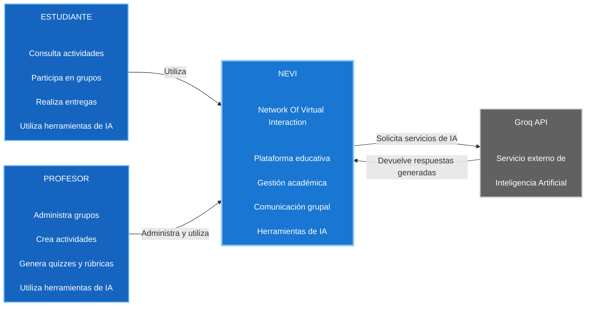

# C4 Nivel 1 — Diagrama de Contexto

## 1. Objetivo

El modelo C4 Nivel 1 representa el contexto general del sistema **NEVI
(Network Of Virtual Interaction)**, identificando los usuarios que interactúan
con la plataforma y los sistemas externos con los que NEVI establece
comunicación.

Esta vista proporciona una representación de alto nivel del sistema, sin
mostrar detalles internos de implementación como componentes frontend,
backend, bases de datos o protocolos de comunicación.

---

## 2. Propósito de la vista

Esta vista permite comprender el sistema NEVI desde una perspectiva general,
identificando los principales actores que utilizan la plataforma, las
funcionalidades que realizan y los servicios externos con los que el sistema
interactúa.

La representación permite establecer el límite del sistema antes de
profundizar en su arquitectura interna mediante los modelos C4 Nivel 2 y
Nivel 3.

En este nivel, NEVI se considera como un único sistema, independientemente de
las tecnologías utilizadas internamente.

---

## 3. Audiencia

Esta vista está dirigida principalmente a:

* Docentes y evaluadores.
* Arquitectos de software.
* Desarrolladores.
* Integrantes del equipo del proyecto.
* Personas interesadas en comprender el propósito y contexto general de NEVI.

---

# 4. Elementos del contexto

## 4.1 Estudiante

**Tipo:** Usuario de la plataforma.

El estudiante utiliza NEVI para participar en grupos académicos, consultar
actividades, realizar entregas, comunicarse mediante el chat grupal y utilizar
las herramientas de inteligencia artificial disponibles en la plataforma.

Entre sus principales interacciones se encuentran:

* Iniciar sesión en la plataforma.
* Unirse a grupos mediante código.
* Consultar actividades académicas.
* Realizar entregas.
* Participar en conversaciones grupales.
* Consultar al asistente académico.
* Utilizar herramientas de IA para facilitar la comprensión de actividades.

---

## 4.2 Profesor

**Tipo:** Usuario de la plataforma.

El profesor utiliza NEVI para administrar sus grupos y gestionar actividades
académicas, además de utilizar las herramientas de inteligencia artificial
disponibles para apoyar la creación y evaluación de contenidos.

Entre sus principales interacciones se encuentran:

* Iniciar sesión en la plataforma.
* Crear y administrar grupos.
* Consultar integrantes de los grupos.
* Crear actividades académicas.
* Generar actividades mediante IA.
* Generar quizzes.
* Generar rúbricas.
* Generar retroalimentación.
* Consultar información y estado de los grupos.
* Comunicarse con los estudiantes mediante el chat grupal.

---

## 4.3 NEVI

**Tipo:** Sistema principal.

**Nombre:** Network Of Virtual Interaction.

NEVI es una plataforma educativa orientada a la interacción entre estudiantes
y profesores.

El sistema proporciona funcionalidades relacionadas con:

* Gestión de usuarios y autenticación.
* Gestión de grupos académicos.
* Gestión de actividades.
* Entrega de actividades.
* Comunicación grupal.
* Herramientas de inteligencia artificial.
* Apoyo académico.
* Generación de contenido educativo.

En el Nivel 1, todas las funcionalidades internas de NEVI se representan como
parte de un único sistema, sin detallar su implementación tecnológica.

---

## 4.4 Groq API

**Tipo:** Sistema externo.

Groq API es el servicio externo utilizado por NEVI para proporcionar las
capacidades de inteligencia artificial de la plataforma.

NEVI utiliza este servicio para funcionalidades como:

* Asistencia académica.
* Generación de actividades.
* Generación de quizzes.
* Generación de rúbricas.
* Generación de retroalimentación.
* Explicación simplificada de actividades.
* Generación de resúmenes de grupos.

La integración con Groq se encuentra implementada en el frontend mediante el
servicio `frontend/src/services/groq.js`, que centraliza las solicitudes de
inteligencia artificial.

---

# 5. Relaciones entre los elementos

Las principales relaciones identificadas en el contexto del sistema son:

| Origen     | Relación                                      | Destino  |
| ---------- | --------------------------------------------- | -------- |
| Estudiante | Utiliza la plataforma                         | NEVI     |
| Profesor   | Administra y utiliza la plataforma            | NEVI     |
| NEVI       | Solicita servicios de inteligencia artificial | Groq API |
| Groq API   | Devuelve respuestas generadas                 | NEVI     |

---

# 6. Diagrama C4 Nivel 1

---

# 7. Trazabilidad con la implementación

Aunque el Nivel 1 no requiere mostrar archivos o tecnologías internas, los
elementos representados pueden relacionarse con la implementación actual del
repositorio.

| Elemento C4 | Evidencia en el sistema                                                                    | Estado         |
| ----------- | ------------------------------------------------------------------------------------------ | -------------- |
| Estudiante  | Funcionalidades de grupos, actividades, entregas, mensajes y asistencia académica          | **Verificado** |
| Profesor    | Funcionalidades de creación de grupos, actividades, quizzes, rúbricas y herramientas de IA | **Verificado** |
| NEVI        | Aplicación frontend + backend que implementa la plataforma                                 | **Verificado** |
| Groq API    | `frontend/src/services/groq.js` y funciones de generación mediante IA                      | **Verificado** |

Las funcionalidades de inteligencia artificial están centralizadas en
`groq.js`, donde se implementan las operaciones de asistencia académica,
generación de actividades, quizzes, rúbricas, retroalimentación, explicación
simplificada y resumen de grupos.

---

# 8. Límite del sistema

En este nivel se establece el siguiente límite conceptual:

**Dentro del sistema:**

* NEVI.

**Usuarios externos:**

* Estudiante.
* Profesor.

**Sistema externo:**

* Groq API.

Los componentes tecnológicos internos de NEVI, como React/Vite, Spring Boot,
Spring Security, JWT, WebSocket/STOMP, PostgreSQL y Nginx, no se representan
en este nivel porque forman parte de la descomposición interna del sistema y
se detallan en el modelo C4 Nivel 2.

---

# 9. Conclusión

El modelo C4 Nivel 1 permite representar a NEVI como un sistema educativo
orientado a la interacción entre estudiantes y profesores.

Los estudiantes utilizan la plataforma para participar en grupos, consultar
y entregar actividades, comunicarse y acceder a herramientas de apoyo
académico.

Los profesores utilizan NEVI para administrar grupos, crear y gestionar
actividades y utilizar herramientas de inteligencia artificial para apoyar
diferentes procesos académicos.

NEVI se comunica además con Groq API como servicio externo para proporcionar
las funcionalidades de inteligencia artificial implementadas actualmente en
la plataforma.

Esta vista establece el contexto general del sistema y sirve como punto de
entrada para los modelos C4 de Nivel 2 y Nivel 3, donde se detallan
respectivamente los contenedores y componentes que conforman la implementación
de NEVI.
