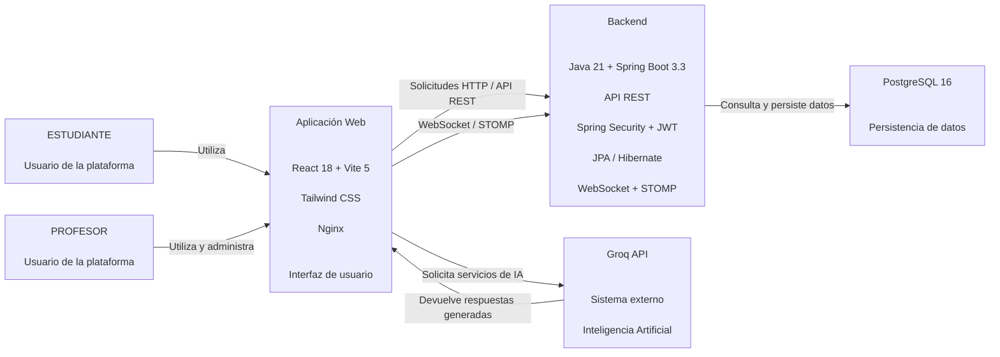

# C4 Nivel 2 — Modelo de Contenedores de NOVI

## 1. Objetivo

El modelo C4 Nivel 2 presenta los principales contenedores que conforman el sistema **NOVI (Network Of Virtual Interaction)** y muestra cómo se relacionan entre sí, con los usuarios y con los servicios externos utilizados por la plataforma.

Esta vista permite pasar del contexto general presentado en el C4 Nivel 1 a una descripción de las principales unidades tecnológicas que implementan las funcionalidades de comunicación, gestión académica e inteligencia artificial de NOVI.

La representación corresponde al estado actual de la solución implementada en el repositorio y no a una arquitectura futura propuesta.

---

## 2. Propósito de la vista

El propósito de esta vista es identificar las principales unidades tecnológicas que conforman NOVI y describir la responsabilidad de cada una.

La arquitectura está compuesta principalmente por:

* Una aplicación web desarrollada con React y Vite.
* Un backend desarrollado con Java y Spring Boot.
* Una base de datos PostgreSQL.
* Un servicio externo de inteligencia artificial proporcionado por Groq.

Los servicios principales de NOVI se ejecutan **localmente mediante Docker Compose**. Docker permite empaquetar y ejecutar cada servicio de la aplicación en contenedores independientes, mientras que Docker Compose permite iniciar y coordinar el conjunto de servicios.

La comunicación en tiempo real mediante WebSocket/STOMP forma parte del backend y de la aplicación web, por lo que no se representa como un contenedor independiente.

De igual manera, Nginx forma parte del contenedor del frontend y se utiliza para servir la aplicación web construida para producción.

---

## 3. Audiencia

Esta vista está dirigida principalmente a:

* Docentes y evaluadores.
* Arquitectos de software.
* Desarrolladores.
* Integrantes del equipo del proyecto.
* Personas interesadas en comprender la estructura tecnológica de NOVI.

---

# 4. Contenedores identificados

## 4.1 Aplicación Web — Frontend

**Tipo:** Contenedor de aplicación.

**Responsabilidad:**

Proporcionar la interfaz de usuario de NOVI y permitir la interacción de estudiantes y profesores con las funcionalidades de la plataforma.

El frontend implementa las interfaces relacionadas con:

* Autenticación.
* Gestión de grupos.
* Actividades académicas.
* Entregas.
* Comunicación grupal.
* Herramientas de inteligencia artificial.
* Asistencia académica.

Entre las interfaces implementadas se encuentran páginas y componentes relacionados con `Login`, `Register`, `Dashboard`, `Grupos` y `GrupoDetalle`, además de funcionalidades para actividades, quizzes, rúbricas, retroalimentación y asistencia mediante IA.

**Tecnología:**

React 18 + Vite 5 + Tailwind CSS 3.

**Implementación:**

El frontend se encuentra en:

```text
frontend/
```

Los servicios utilizados para la comunicación con el backend y los servicios externos se encuentran principalmente en:

```text
frontend/src/services/
```

Entre ellos se encuentran servicios para autenticación, API, grupos, actividades, mensajes y Groq.

El frontend utiliza **WebSocket mediante STOMP y SockJS** para las funcionalidades de comunicación en tiempo real.

Nginx se encuentra integrado en el contenedor del frontend para servir la aplicación construida.

---

## 4.2 Backend — API y lógica de negocio

**Tipo:** Contenedor de aplicación.

**Responsabilidad:**

Centralizar la lógica de negocio de NOVI y proporcionar los servicios necesarios para que el frontend pueda realizar operaciones sobre la plataforma.

El backend gestiona principalmente:

* Usuarios.
* Autenticación y autorización.
* Grupos.
* Integrantes de grupos.
* Actividades.
* Información académica.
* Persistencia de datos.
* Comunicación en tiempo real.

También proporciona la API utilizada por el frontend y gestiona la comunicación WebSocket/STOMP utilizada para el chat.

**Tecnología:**

Java 21 + Spring Boot 3.3 + Maven.

**Seguridad:**

Spring Security + JWT.

**Persistencia:**

Spring Data JPA / Hibernate.

**Comunicación en tiempo real:**

WebSocket + STOMP.

**Implementación:**

El backend se encuentra en:

```text
backend/
```

La estructura principal se encuentra bajo:

```text
backend/src/main/java/com/nevi/
```

Aunque el código utiliza actualmente el paquete `com.nevi`, la documentación arquitectónica utiliza el nombre del sistema **NOVI**.

---

## 4.3 PostgreSQL — Base de Datos

**Tipo:** Contenedor de base de datos.

**Responsabilidad:**

Almacenar de forma persistente la información utilizada por NOVI.

A nivel conceptual, la base de datos almacena información relacionada con:

* Usuarios.
* Perfiles.
* Roles.
* Grupos.
* Integrantes de grupos.
* Mensajes.
* Actividades.
* Quizzes.
* Rúbricas.
* Retroalimentación.
* Información relacionada con las funcionalidades académicas.

**Tecnología:**

PostgreSQL 16.

**Implementación:**

PostgreSQL se ejecuta **localmente dentro de Docker** como un servicio denominado:

```text
nevi-db
```

El servicio utiliza PostgreSQL 16 y cuenta con un volumen persistente:

```text
nevi_db_data
```

Este volumen permite conservar los datos aunque el contenedor sea detenido o recreado.

La gestión de las entidades y la persistencia se realiza desde el backend mediante Spring Data JPA/Hibernate.

---

## 4.4 Groq API — Sistema externo

**Tipo:** Sistema externo.

**Responsabilidad:**

Proporcionar los servicios de inteligencia artificial utilizados por NOVI.

La integración permite ofrecer funcionalidades de apoyo académico para estudiantes y profesores.

Entre las funcionalidades implementadas se encuentran:

* Tutor académico.
* Generación de actividades.
* Generación de quizzes.
* Generación de rúbricas.
* Generación de retroalimentación.
* Explicación simplificada de actividades.
* Generación de resúmenes de grupos.

**Implementación:**

La integración se encuentra principalmente en:

```text
frontend/src/services/groq.js
```

Entre las funciones utilizadas se encuentran:

```text
preguntarIA()
generarActividad()
generarQuiz()
generarRubrica()
generarRetroalimentacion()
resumirActividad()
generarResumenGrupo()
```

La comunicación con el servicio utiliza la variable de entorno:

```text
VITE_GROQ_API_KEY
```

A diferencia de los servicios principales de NOVI, **Groq API no se ejecuta localmente**. Es un servicio externo utilizado por la aplicación para proporcionar las funcionalidades de inteligencia artificial.

---

# 5. Comunicación en tiempo real

La comunicación en tiempo real utilizada para el chat se implementa mediante **WebSocket con STOMP y SockJS**.

Este mecanismo no constituye un contenedor independiente.

La comunicación forma parte de la interacción entre:

```text
Aplicación Web
       ↕
Backend
```

El frontend utiliza:

```text
@stomp/stompjs
sockjs-client
```

para establecer la comunicación en tiempo real.

La URL del servicio WebSocket se configura mediante:

```text
VITE_WS_URL
```

El backend Spring Boot gestiona las conexiones y los mensajes mediante la configuración correspondiente de WebSocket/STOMP.

Por esta razón, en el modelo C4 Nivel 2 WebSocket se representa como un **mecanismo de comunicación del backend y frontend**, y no como un quinto contenedor.

---

# 6. Relaciones entre los contenedores

Las principales relaciones arquitectónicas son:

| Origen         | Relación                                                       | Destino        |
| -------------- | -------------------------------------------------------------- | -------------- |
| Estudiante     | Utiliza la aplicación web                                      | Aplicación Web |
| Profesor       | Utiliza y administra la plataforma                             | Aplicación Web |
| Aplicación Web | Realiza solicitudes mediante API REST                          | Backend        |
| Aplicación Web | Establece comunicación en tiempo real mediante WebSocket/STOMP | Backend        |
| Backend        | Consulta y persiste información                                | PostgreSQL     |
| Aplicación Web | Solicita servicios de inteligencia artificial                  | Groq API       |
| Groq API       | Devuelve respuestas generadas                                  | Aplicación Web |

La comunicación entre los servicios principales se realiza dentro del entorno local de ejecución proporcionado por Docker Compose.

---

# 7. Diagrama C4 Nivel 2



---

# 8. Ejecución local mediante Docker Compose

Los principales servicios de NOVI se ejecutan localmente utilizando Docker Compose.

El archivo:

```text
docker-compose.yml
```

define los servicios principales de la aplicación:

| Servicio Docker | Función                               |
| --------------- | ------------------------------------- |
| `nevi-frontend` | Frontend React servido mediante Nginx |
| `nevi-backend`  | Backend Java / Spring Boot            |
| `nevi-db`       | Base de datos PostgreSQL 16           |

La arquitectura local puede representarse de la siguiente manera:

```text
                    NOVI — EJECUCIÓN LOCAL

        ┌─────────────────────────────────────┐
        │            Docker Compose           │
        │                                     │
        │  ┌───────────────┐                  │
        │  │ nevi-frontend │                  │
        │  │ React + Vite  │                  │
        │  │     + Nginx   │                  │
        │  └───────┬───────┘                  │
        │          │ REST / WebSocket         │
        │          ▼                          │
        │  ┌───────────────┐                  │
        │  │ nevi-backend  │                  │
        │  │ Spring Boot   │                  │
        │  │ JWT + JPA     │                  │
        │  └───────┬───────┘                  │
        │          │                          │
        │          ▼                          │
        │  ┌───────────────┐                  │
        │  │    nevi-db    │                  │
        │  │ PostgreSQL 16 │                  │
        │  └───────────────┘                  │
        │                                     │
        └─────────────────────────────────────┘
                         │
                         │ Solicitudes de IA
                         ▼
                  ┌───────────────┐
                  │   Groq API    │
                  │    EXTERNO    │
                  └───────────────┘
```

Docker Compose permite levantar los servicios principales de NOVI de forma integrada mediante:

```bash
docker compose up --build
```

De esta manera, el frontend, backend y PostgreSQL funcionan como servicios locales dentro de Docker.

Groq API permanece fuera de este entorno, debido a que corresponde a un servicio externo.

---

# 9. Diferencia entre contenedores C4 y contenedores Docker

Es importante diferenciar ambos conceptos.

Los **contenedores C4** representan las principales unidades tecnológicas que forman parte de la arquitectura de software.

Los **contenedores Docker** representan unidades de ejecución utilizadas para empaquetar y ejecutar los servicios.

En NOVI existe una correspondencia aproximada:

| Contenedor C4  | Servicio Docker |
| -------------- | --------------- |
| Aplicación Web | `nevi-frontend` |
| Backend        | `nevi-backend`  |
| PostgreSQL     | `nevi-db`       |

Sin embargo:

* Docker Compose no es un contenedor C4.
* WebSocket no es un contenedor C4 independiente.
* Nginx no es un contenedor C4 independiente porque forma parte del servicio del frontend.
* Groq API no forma parte de Docker Compose, ya que es un sistema externo.

---

# 10. Resumen arquitectónico

La arquitectura de contenedores de NOVI se organiza de la siguiente manera:

```text
Usuarios
   │
   ▼
Aplicación Web
React + Vite + Nginx
   │
   ├──────────────► Groq API
   │                 (Externo)
   │
   │ REST / WebSocket
   ▼
Backend
Spring Boot
JWT + JPA + STOMP
   │
   ▼
PostgreSQL
```

Los tres servicios principales de NOVI se ejecutan localmente mediante Docker Compose:

```text
nevi-frontend
nevi-backend
nevi-db
```

El frontend proporciona la interfaz de usuario, el backend centraliza la lógica de negocio, seguridad, API y comunicación en tiempo real, mientras que PostgreSQL proporciona la persistencia de los datos.

La inteligencia artificial se integra mediante Groq API, que permanece como un sistema externo.

Esta vista representa la arquitectura tecnológica actualmente implementada en NOVI y sirve como base para el **C4 Nivel 3 — Modelo de Componentes**.
