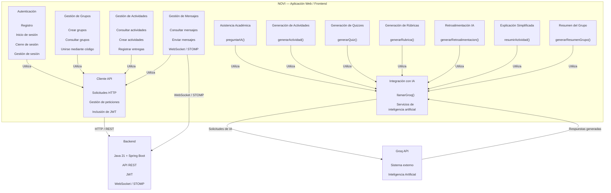

# C4 Nivel 3 — Modelo de Componentes de NOVI

## 1. Objetivo

El modelo C4 Nivel 3 presenta la descomposición interna del contenedor **Aplicación Web — Frontend** de **NOVI (Network Of Virtual Interaction)**, identificando los componentes arquitectónicamente relevantes que implementan las principales funcionalidades de la plataforma.

El objetivo de esta vista es establecer una correspondencia verificable entre los componentes definidos en la arquitectura y los módulos, archivos y funciones presentes en la implementación actual del repositorio.

La representación corresponde al estado actual de la aplicación frontend de NOVI y no a una arquitectura futura propuesta.

---

# 2. Alcance

Esta vista corresponde al contenedor **Aplicación Web — Frontend** identificado en el modelo C4 Nivel 2.

Se incluyen los componentes que poseen una responsabilidad funcional relevante dentro del frontend y que pueden relacionarse directamente con archivos y funciones existentes en:

```text
frontend/src/
```

El Backend Spring Boot y PostgreSQL no se descomponen en este nivel, ya que pertenecen a otros contenedores del sistema y serán tratados en sus respectivos niveles de detalle.

Groq API se representa como un sistema externo con el que los componentes de inteligencia artificial establecen comunicación.

El repositorio organiza el frontend principalmente mediante páginas, componentes y servicios. Entre los servicios relevantes se encuentran:

```text
frontend/src/services/api.js
frontend/src/services/auth.js
frontend/src/services/grupos.js
frontend/src/services/actividades.js
frontend/src/services/mensajes.js
frontend/src/services/groq.js
```

---

# 3. Audiencia

Esta vista está dirigida principalmente a:

* Docentes y evaluadores del proyecto.
* Arquitectos de software.
* Desarrolladores.
* Integrantes del equipo de desarrollo.

---

# 4. Componentes identificados

## 4.1 Componente de Autenticación

**Responsabilidad:**

Gestionar las operaciones de autenticación desde la interfaz web, incluyendo registro, inicio de sesión, cierre de sesión y recuperación de la sesión local del usuario.

**Implementación:**

```text
frontend/src/services/auth.js
```

**Funciones principales:**

* `registrarUsuario()`
* `iniciarSesion()`
* `cerrarSesion()`
* `obtenerPerfil()`
* `obtenerSesionLocal()`

El componente utiliza el cliente API para comunicarse con los endpoints relacionados con autenticación:

```text
POST /api/auth/register
POST /api/auth/login
GET /api/auth/perfil
```

El token JWT recibido del backend se almacena localmente para mantener la sesión del usuario.

---

## 4.2 Componente Cliente API

**Responsabilidad:**

Centralizar las solicitudes HTTP realizadas desde el frontend hacia el Backend Spring Boot.

Este componente evita que cada módulo tenga que implementar individualmente la lógica de comunicación HTTP y permite incluir automáticamente el token JWT cuando existe una sesión autenticada.

**Implementación:**

```text
frontend/src/services/api.js
```

**Funciones principales:**

* `request()`
* `api.get()`
* `api.post()`
* `api.put()`
* `api.delete()`

El módulo obtiene la URL base mediante:

```text
VITE_API_URL
```

y agrega el encabezado de autorización cuando existe un token almacenado localmente.

Este componente funciona como módulo transversal utilizado por diferentes servicios del frontend.

---

## 4.3 Componente de Gestión de Grupos

**Responsabilidad:**

Gestionar desde el frontend las operaciones relacionadas con los grupos académicos.

Permite realizar operaciones como:

* Crear grupos.
* Consultar grupos.
* Unirse a grupos mediante código.

**Implementación:**

```text
frontend/src/services/grupos.js
```

**Funciones principales:**

* `crearGrupo()`
* `obtenerMisGrupos()`
* `unirseAGrupo()`

**Endpoints utilizados:**

```text
POST /api/grupos
GET /api/grupos
POST /api/grupos/unirse
```

El backend identifica al usuario mediante el JWT asociado a las solicitudes.

---

## 4.4 Componente de Gestión de Actividades

**Responsabilidad:**

Gestionar desde el frontend las operaciones relacionadas con las actividades académicas.

Permite:

* Consultar actividades.
* Crear actividades.
* Registrar entregas.
* Consultar entregas realizadas.

**Implementación:**

```text
frontend/src/services/actividades.js
```

**Funciones principales:**

* `obtenerActividades()`
* `crearActividad()`
* `entregarActividad()`
* `obtenerMisEntregas()`

**Endpoints utilizados:**

```text
GET /api/actividades
POST /api/actividades
POST /api/actividades/{id}/entregar
GET /api/actividades/mis-entregas
```

Este componente utiliza el cliente API para comunicarse con el backend.

---

## 4.5 Componente de Gestión de Mensajes

**Responsabilidad:**

Gestionar los mensajes de los grupos y establecer la comunicación en tiempo real utilizada para el chat.

Este componente combina:

* Comunicación HTTP para consultar y enviar información.
* WebSocket/STOMP para recibir mensajes en tiempo real.

**Implementación:**

```text
frontend/src/services/mensajes.js
```

**Funciones principales:**

* `obtenerMensajes()`
* `enviarMensaje()`
* `suscribirseAMensajes()`
* `desuscribirse()`

El módulo utiliza:

```text
@stomp/stompjs
sockjs-client
```

y configura la conexión mediante:

```text
VITE_WS_URL
```

La comunicación en tiempo real utiliza suscripciones STOMP a los topics correspondientes a los grupos.

El WebSocket no constituye un componente C4 independiente del frontend ni un contenedor independiente. Es un mecanismo de comunicación entre este componente y el contenedor Backend.

---

# 5. Componentes de Inteligencia Artificial

## 5.1 Componente de Integración con Inteligencia Artificial

**Responsabilidad:**

Centralizar las solicitudes realizadas desde el frontend hacia Groq API y proporcionar una interfaz común para las diferentes funcionalidades de inteligencia artificial.

**Implementación:**

```text
frontend/src/services/groq.js
```

**Funciones principales:**

* `llamarGroq()`
* `preguntarIA()`
* `generarActividad()`
* `generarQuiz()`
* `generarRubrica()`
* `generarRetroalimentacion()`
* `resumirActividad()`
* `generarResumenGrupo()`

Este módulo centraliza las solicitudes realizadas al servicio externo de inteligencia artificial.

---

## 5.2 Componente de Asistencia Académica

**Responsabilidad:**

Proporcionar al estudiante un asistente académico capaz de responder preguntas mediante inteligencia artificial.

**Implementación:**

```text
frontend/src/components/AsistenteIA.jsx
```

**Servicio utilizado:**

```text
frontend/src/services/groq.js
```

**Función utilizada:**

```text
preguntarIA()
```

El componente recibe la pregunta del estudiante y utiliza el servicio de integración con Groq para obtener una respuesta generada.

---

## 5.3 Componente de Generación de Actividades mediante IA

**Responsabilidad:**

Asistir al profesor en la creación de actividades académicas mediante la generación automática de contenido a partir de un tema.

**Implementación:**

```text
frontend/src/components/CrearActividad.jsx
```

**Servicio utilizado:**

```text
frontend/src/services/groq.js
```

**Función utilizada:**

```text
generarActividad()
```

La función recibe el tema indicado por el profesor y solicita a Groq la generación de contenido para la actividad.

---

## 5.4 Componente de Generación de Quizzes

**Responsabilidad:**

Permitir al profesor generar preguntas de opción múltiple mediante inteligencia artificial.

**Implementación:**

```text
frontend/src/components/ModalQuiz.jsx
```

**Servicio utilizado:**

```text
frontend/src/services/groq.js
```

**Función utilizada:**

```text
generarQuiz()
```

La función recibe el tema y la cantidad de preguntas y solicita a Groq la generación de las preguntas correspondientes.

---

## 5.5 Componente de Generación de Rúbricas

**Responsabilidad:**

Asistir al profesor en la creación de instrumentos de evaluación mediante la generación de criterios y niveles de desempeño.

**Implementación:**

```text
frontend/src/components/ModalRubrica.jsx
```

**Servicio utilizado:**

```text
frontend/src/services/groq.js
```

**Función utilizada:**

```text
generarRubrica()
```

La función recibe la información de la actividad y solicita a Groq la generación de una rúbrica.

---

## 5.6 Componente de Retroalimentación mediante IA

**Responsabilidad:**

Generar retroalimentación a partir de una actividad y de la respuesta proporcionada por un estudiante.

**Implementación:**

```text
frontend/src/components/ModalRetroalimentacion.jsx
```

**Servicio utilizado:**

```text
frontend/src/services/groq.js
```

**Función utilizada:**

```text
generarRetroalimentacion()
```

La función utiliza la información de la actividad y la respuesta del estudiante para solicitar a Groq una retroalimentación generada.

---

## 5.7 Componente de Explicación Simplificada

**Responsabilidad:**

Facilitar la comprensión de las actividades mediante una explicación en lenguaje sencillo.

**Implementación:**

```text
frontend/src/components/ModalExplicacion.jsx
```

**Servicio utilizado:**

```text
frontend/src/services/groq.js
```

**Función utilizada:**

```text
resumirActividad()
```

La función recibe información de la actividad y solicita a Groq una explicación simplificada.

---

## 5.8 Componente de Resumen del Grupo

**Responsabilidad:**

Generar un resumen del estado de un grupo utilizando la información disponible de sus actividades.

**Implementación:**

```text
frontend/src/pages/GrupoDetalle.jsx
```

**Servicio utilizado:**

```text
frontend/src/services/groq.js
```

**Función utilizada:**

```text
generarResumenGrupo()
```

Esta funcionalidad utiliza la información de las actividades del grupo para solicitar a Groq un resumen generado mediante inteligencia artificial.

---

# 6. Diagrama C4 Nivel 3

El siguiente diagrama representa la descomposición del contenedor **Aplicación Web — Frontend**.



---

# 7. Relaciones entre componentes y otros contenedores

Los componentes del frontend se relacionan con los demás elementos de la arquitectura de NOVI de la siguiente manera:

| Componente                | Comunicación           | Destino  |
| ------------------------- | ---------------------- | -------- |
| Autenticación             | HTTP / REST            | Backend  |
| Cliente API               | HTTP / REST            | Backend  |
| Gestión de Grupos         | Cliente API            | Backend  |
| Gestión de Actividades    | Cliente API            | Backend  |
| Gestión de Mensajes       | HTTP / REST            | Backend  |
| Gestión de Mensajes       | WebSocket / STOMP      | Backend  |
| Integración con IA        | Solicitudes de IA      | Groq API |
| Asistencia Académica      | Utiliza integración IA | Groq API |
| Generación de Actividades | Utiliza integración IA | Groq API |
| Generación de Quizzes     | Utiliza integración IA | Groq API |
| Generación de Rúbricas    | Utiliza integración IA | Groq API |
| Retroalimentación IA      | Utiliza integración IA | Groq API |
| Explicación Simplificada  | Utiliza integración IA | Groq API |
| Resumen del Grupo         | Utiliza integración IA | Groq API |

PostgreSQL no se conecta directamente con los componentes del frontend. La persistencia se realiza a través del **Backend Spring Boot**, que pertenece a otro contenedor del sistema.

---

# 8. Trazabilidad con la implementación

La siguiente tabla relaciona los componentes arquitectónicos con los archivos y funciones identificados en la implementación actual.

| Componente C4             | Archivo / módulo                                     | Funciones o elementos relacionados                                                                                                                                      |
| ------------------------- | ---------------------------------------------------- | ----------------------------------------------------------------------------------------------------------------------------------------------------------------------- |
| Autenticación             | `frontend/src/services/auth.js`                      | `registrarUsuario()`, `iniciarSesion()`, `cerrarSesion()`, `obtenerPerfil()`, `obtenerSesionLocal()`                                                                    |
| Cliente API               | `frontend/src/services/api.js`                       | `request()`, `api.get()`, `api.post()`, `api.put()`, `api.delete()`                                                                                                     |
| Gestión de Grupos         | `frontend/src/services/grupos.js`                    | `crearGrupo()`, `obtenerMisGrupos()`, `unirseAGrupo()`                                                                                                                  |
| Gestión de Actividades    | `frontend/src/services/actividades.js`               | `obtenerActividades()`, `crearActividad()`, `entregarActividad()`, `obtenerMisEntregas()`                                                                               |
| Gestión de Mensajes       | `frontend/src/services/mensajes.js`                  | `obtenerMensajes()`, `enviarMensaje()`, `suscribirseAMensajes()`, `desuscribirse()`                                                                                     |
| Integración con IA        | `frontend/src/services/groq.js`                      | `llamarGroq()`, `preguntarIA()`, `generarActividad()`, `generarQuiz()`, `generarRubrica()`, `generarRetroalimentacion()`, `resumirActividad()`, `generarResumenGrupo()` |
| Asistencia Académica      | `frontend/src/components/AsistenteIA.jsx`            | `preguntarIA()`                                                                                                                                                         |
| Generación de Actividades | `frontend/src/components/CrearActividad.jsx`         | `generarActividad()`                                                                                                                                                    |
| Generación de Quizzes     | `frontend/src/components/ModalQuiz.jsx`              | `generarQuiz()`                                                                                                                                                         |
| Generación de Rúbricas    | `frontend/src/components/ModalRubrica.jsx`           | `generarRubrica()`                                                                                                                                                      |
| Retroalimentación IA      | `frontend/src/components/ModalRetroalimentacion.jsx` | `generarRetroalimentacion()`                                                                                                                                            |
| Explicación Simplificada  | `frontend/src/components/ModalExplicacion.jsx`       | `resumirActividad()`                                                                                                                                                    |
| Resumen del Grupo         | `frontend/src/pages/GrupoDetalle.jsx`                | `generarResumenGrupo()`                                                                                                                                                 |

Esta correspondencia permite verificar que los componentes representados en el modelo arquitectónico tienen una implementación concreta dentro del frontend.

---

# 9. Relación con Docker

El modelo C4 Nivel 3 describe los componentes internos del frontend, mientras que Docker corresponde al mecanismo de ejecución de la aplicación.

El frontend que contiene estos componentes se ejecuta localmente mediante el servicio Docker:

```text
nevi-frontend
```

Este servicio contiene la aplicación React/Vite y utiliza Nginx para servir la aplicación construida.

Por lo tanto:

```text
Docker Compose
      │
      ▼
nevi-frontend
      │
      ▼
Aplicación Web
      │
      ├── Autenticación
      ├── Cliente API
      ├── Gestión de Grupos
      ├── Gestión de Actividades
      ├── Gestión de Mensajes
      └── Componentes de IA
```

Docker no representa un componente funcional del frontend y por eso no aparece como componente C4 Nivel 3.

---

# 10. Conclusión

El modelo C4 Nivel 3 descompone el contenedor **Aplicación Web — Frontend** de NOVI en componentes funcionales que pueden relacionarse directamente con la implementación actual del proyecto.

Los principales componentes identificados son:

* Autenticación.
* Cliente API.
* Gestión de Grupos.
* Gestión de Actividades.
* Gestión de Mensajes.
* Integración con Inteligencia Artificial.
* Asistencia Académica.
* Generación de Actividades.
* Generación de Quizzes.
* Generación de Rúbricas.
* Retroalimentación mediante IA.
* Explicación Simplificada.
* Resumen del Grupo.

Los componentes de gestión académica utilizan el Backend Spring Boot mediante API REST, mientras que el componente de mensajes utiliza tanto comunicación HTTP como WebSocket/STOMP para la comunicación en tiempo real.

Las funcionalidades de inteligencia artificial se centralizan mediante `groq.js` y se comunican con Groq API, que permanece como servicio externo.

La aplicación frontend se ejecuta localmente como parte del servicio Docker `nevi-frontend`, mientras que Docker Compose coordina este servicio con el backend y PostgreSQL.

La relación general de la arquitectura puede resumirse como:

**Usuario → Aplicación Web → Backend → PostgreSQL**

con las siguientes integraciones:

**Gestión de Mensajes → WebSocket/STOMP → Backend**

y

**Componentes de IA → `groq.js` → Groq API**

Esta vista corresponde al estado actual de implementación de NOVI y sirve como base para relacionar la arquitectura con el código fuente mediante el documento de **Trazabilidad**.
