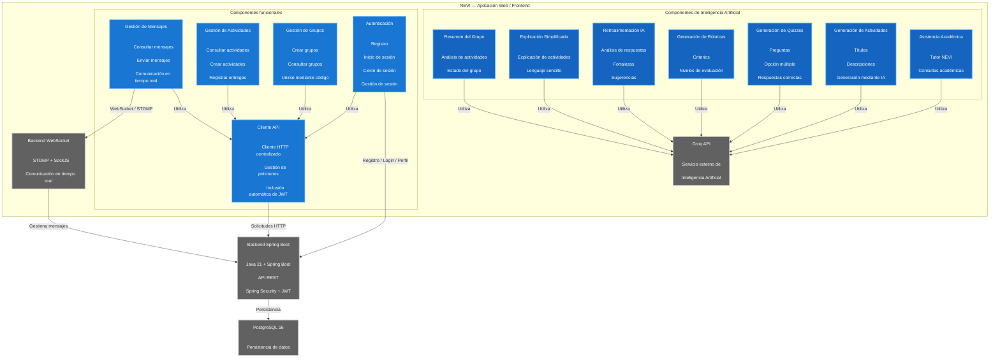

# C4 Nivel 3 — Componentes NEVI

## 1. Objetivo

El modelo C4 Nivel 3 presenta la descomposición interna del contenedor
**"Aplicación Web — Frontend"** de NEVI, identificando los componentes
arquitectónicamente relevantes que implementan las principales funcionalidades
de la plataforma.

El objetivo de esta vista es establecer una correspondencia verificable entre
los componentes definidos en la arquitectura y los módulos, archivos y
funciones presentes en la implementación actual del repositorio.

La representación corresponde al estado actual de la aplicación frontend de
NEVI y no a una arquitectura futura propuesta.

---

## 2. Alcance

Esta vista corresponde exclusivamente al contenedor **"Aplicación Web —
Frontend"** identificado en el modelo C4 Nivel 2.

Se incluyen los componentes que poseen responsabilidad arquitectónica
relevante dentro del frontend y que pueden relacionarse directamente con
archivos y funciones existentes en:

`frontend/src/`

El backend Spring Boot, PostgreSQL y Groq API se representan como sistemas
externos al contenedor, debido a que pertenecen a otros contenedores o
servicios identificados en el Nivel 2.

El repositorio actual organiza el frontend principalmente mediante páginas,
componentes, contexto y servicios. Entre los servicios se encuentran
`api.js`, `auth.js`, `grupos.js`, `actividades.js`, `mensajes.js` y
`groq.js`.

---

## 3. Audiencia

Esta vista está dirigida principalmente a:

* Docentes y evaluadores del proyecto.
* Arquitectos de software.
* Desarrolladores del sistema.
* Integrantes del equipo de desarrollo.

---

# 4. Componentes identificados

## 4.1 Componente de Autenticación

**Responsabilidad:**

Gestionar las operaciones de autenticación desde la interfaz web, incluyendo
registro, inicio de sesión, cierre de sesión y recuperación de la sesión local
del usuario.

**Implementación verificable:**

`frontend/src/services/auth.js`

**Funciones principales:**

* `registrarUsuario()`
* `iniciarSesion()`
* `cerrarSesion()`
* `obtenerPerfil()`
* `obtenerSesionLocal()`

El componente utiliza el cliente HTTP centralizado para comunicarse con los
endpoints `/api/auth/register`, `/api/auth/login` y `/api/auth/perfil`.

El token JWT recibido por el backend se almacena en `localStorage` bajo
`nevi_token`, mientras que la información básica del usuario se almacena bajo
`nevi_user`.

---

## 4.2 Componente Cliente API

**Responsabilidad:**

Centralizar las solicitudes HTTP realizadas desde el frontend hacia el
backend Spring Boot.

Este componente evita que cada módulo tenga que implementar individualmente
la lógica de comunicación HTTP y permite adjuntar automáticamente el token
JWT cuando existe una sesión autenticada.

**Implementación verificable:**

`frontend/src/services/api.js`

**Símbolos principales:**

* `request()`
* `api.get()`
* `api.post()`
* `api.put()`
* `api.delete()`

El módulo obtiene la URL base mediante `VITE_API_URL` y agrega el encabezado:

`Authorization: Bearer <token>`

cuando existe un token almacenado en `localStorage`.

---

## 4.3 Componente de Gestión de Grupos

**Responsabilidad:**

Permitir la creación, consulta y unión a grupos académicos.

El componente soporta diferentes operaciones según el rol del usuario,
incluyendo la creación de grupos por parte de profesores y la incorporación
de estudiantes mediante un código de acceso.

**Implementación verificable:**

`frontend/src/services/grupos.js`

**Funciones principales:**

* `crearGrupo()`
* `obtenerMisGrupos()`
* `unirseAGrupo()`

**Endpoints utilizados:**

* `POST /api/grupos`
* `GET /api/grupos`
* `POST /api/grupos/unirse`

El backend identifica al usuario mediante el JWT asociado a las solicitudes.
Para unirse a un grupo se utiliza un código de seis caracteres.

---

## 4.4 Componente de Gestión de Actividades

**Responsabilidad:**

Gestionar desde el frontend las operaciones relacionadas con las actividades
académicas de los grupos.

Permite consultar las actividades, crear nuevas actividades, registrar la
entrega de una actividad y consultar las actividades entregadas por el
estudiante.

**Implementación verificable:**

`frontend/src/services/actividades.js`

**Funciones principales:**

* `obtenerActividades()`
* `crearActividad()`
* `entregarActividad()`
* `obtenerMisEntregas()`

**Endpoints utilizados:**

* `GET /api/actividades`
* `POST /api/actividades`
* `POST /api/actividades/{id}/entregar`
* `GET /api/actividades/mis-entregas`

La implementación también realiza la conversión de la fecha de entrega al
formato utilizado por el backend.

---

## 4.5 Componente de Gestión de Mensajes

**Responsabilidad:**

Gestionar la consulta y envío de mensajes de los grupos y establecer la
comunicación en tiempo real mediante WebSocket.

Este componente combina comunicación HTTP para la persistencia y consulta de
mensajes con WebSocket/STOMP para recibir nuevos mensajes en tiempo real.

**Implementación verificable:**

`frontend/src/services/mensajes.js`

**Funciones principales:**

* `obtenerMensajes()`
* `enviarMensaje()`
* `suscribirseAMensajes()`
* `desuscribirse()`

El módulo utiliza:

* `@stomp/stompjs`
* `sockjs-client`

y establece la conexión utilizando `VITE_WS_URL`.

Los mensajes recibidos se obtienen mediante una suscripción STOMP al topic:

`/topic/grupo/{grupoId}`

El token JWT también se envía en las cabeceras de conexión del WebSocket.

---

## 4.6 Componente de Integración con Inteligencia Artificial

**Responsabilidad:**

Centralizar las solicitudes realizadas desde el frontend hacia Groq API y
proporcionar las diferentes capacidades de inteligencia artificial de NEVI.

**Implementación verificable:**

`frontend/src/services/groq.js`

**Símbolos principales:**

* `llamarGroq()`
* `preguntarIA()`
* `generarActividad()`
* `generarQuiz()`
* `generarRubrica()`
* `generarRetroalimentacion()`
* `resumirActividad()`
* `generarResumenGrupo()`

El módulo centraliza las solicitudes mediante `llamarGroq()` y utiliza el
endpoint de chat completions de Groq. El modelo configurado actualmente en el
archivo es `openai/gpt-oss-20b`.

---

## 4.7 Componente de Asistencia Académica

**Responsabilidad:**

Proporcionar al estudiante un asistente académico capaz de responder
preguntas y explicar conceptos mediante inteligencia artificial.

**Implementación verificable:**

`frontend/src/components/AsistenteIA.jsx`

**Servicio utilizado:**

`frontend/src/services/groq.js`

**Función utilizada:**

`preguntarIA()`

La función `preguntarIA()` utiliza el componente de integración con Groq para
enviar la pregunta del estudiante y obtener una respuesta generada.

---

## 4.8 Componente de Generación de Actividades mediante IA

**Responsabilidad:**

Asistir al profesor en la creación de actividades académicas mediante la
generación automática de un título y una descripción a partir de un tema.

**Implementación verificable:**

`frontend/src/components/CrearActividad.jsx`

**Servicio utilizado:**

`frontend/src/services/groq.js`

**Función utilizada:**

`generarActividad()`

La función recibe el tema indicado por el profesor y solicita a Groq la
generación de una actividad educativa con título y descripción.

---

## 4.9 Componente de Generación de Quizzes

**Responsabilidad:**

Permitir al profesor generar preguntas de opción múltiple mediante
inteligencia artificial.

**Implementación verificable:**

`frontend/src/components/ModalQuiz.jsx`

**Servicio utilizado:**

`frontend/src/services/groq.js`

**Función utilizada:**

`generarQuiz()`

La función recibe el tema y la cantidad de preguntas y solicita una respuesta
estructurada en JSON con las preguntas, opciones y respuestas correctas.

---

## 4.10 Componente de Generación de Rúbricas

**Responsabilidad:**

Asistir al profesor en la creación de instrumentos de evaluación mediante la
generación de criterios y niveles de desempeño.

**Implementación verificable:**

`frontend/src/components/ModalRubrica.jsx`

**Servicio utilizado:**

`frontend/src/services/groq.js`

**Función utilizada:**

`generarRubrica()`

La función recibe el título y la descripción de una actividad y genera una
rúbrica con criterios y niveles de evaluación.

---

## 4.11 Componente de Retroalimentación mediante IA

**Responsabilidad:**

Generar retroalimentación constructiva a partir de una actividad y de la
respuesta proporcionada por un estudiante.

**Implementación verificable:**

`frontend/src/components/ModalRetroalimentacion.jsx`

**Servicio utilizado:**

`frontend/src/services/groq.js`

**Función utilizada:**

`generarRetroalimentacion()`

La función recibe el título de la actividad y la respuesta del estudiante y
solicita a Groq fortalezas, áreas de mejora y sugerencias concretas.

---

## 4.12 Componente de Explicación Simplificada

**Responsabilidad:**

Facilitar la comprensión de las actividades mediante una explicación en
lenguaje sencillo.

**Implementación verificable:**

`frontend/src/components/ModalExplicacion.jsx`

**Servicio utilizado:**

`frontend/src/services/groq.js`

**Función utilizada:**

`resumirActividad()`

La función recibe el título y descripción de una actividad y genera una
explicación simplificada orientada al estudiante.

---

## 4.13 Componente de Resumen del Grupo

**Responsabilidad:**

Analizar la información de las actividades de un grupo y generar un resumen
del estado del grupo mediante inteligencia artificial.

**Implementación verificable:**

`frontend/src/pages/GrupoDetalle.jsx`

**Servicio utilizado:**

`frontend/src/services/groq.js`

**Función utilizada:**

`generarResumenGrupo()`

Esta funcionalidad utiliza la información de las actividades para solicitar
a Groq un análisis del estado del grupo. El README del repositorio identifica
esta función como una de las capacidades de IA disponibles para profesores.

---

# 5. Diagrama C4 Nivel 3

---

# 6. Trazabilidad estricta

La siguiente tabla establece la correspondencia entre los componentes
arquitectónicos representados en el modelo C4 Nivel 3 y los elementos
verificables de la implementación actual de NEVI.

| Nivel C4 | Nombre exacto del elemento           | Responsabilidad declarada                                                                           | Archivo / módulo real                                | Clase, símbolo o configuración verificable                                                           | Relación arquitectónica comprobada        | Estado         |
| -------- | ------------------------------------ | --------------------------------------------------------------------------------------------------- | ---------------------------------------------------- | ---------------------------------------------------------------------------------------------------- | ----------------------------------------- | -------------- |
| C2       | Aplicación Web — Frontend            | Proporcionar la interfaz web de NEVI y coordinar la interacción con los servicios de la plataforma. | `frontend/src/`                                      | `App.jsx`, `main.jsx`, `pages/`, `components/`, `services/`                                          | Usuario → Aplicación Web                  | **Verificado** |
| C2       | Backend Spring Boot                  | Procesar la lógica de negocio y exponer la API de NEVI.                                             | `backend/`                                           | Aplicación Spring Boot                                                                               | Frontend → Backend                        | **Verificado** |
| C2       | PostgreSQL                           | Persistir la información de la plataforma.                                                          | Backend / Docker                                     | PostgreSQL 16 + Spring Data JPA                                                                      | Backend → PostgreSQL                      | **Verificado** |
| C2       | Groq API                             | Proporcionar servicios de inteligencia artificial.                                                  | `frontend/src/services/groq.js`                      | `GROQ_URL`, `MODELO`, `API_KEY`, `llamarGroq()`                                                      | Componentes IA → Groq API                 | **Verificado** |
| C2       | Comunicación WebSocket               | Proporcionar comunicación en tiempo real para el chat grupal.                                       | `frontend/src/services/mensajes.js`                  | `Client`, `SockJS`, `VITE_WS_URL`, `subscribe()`                                                     | Gestión de Mensajes → WebSocket           | **Verificado** |
| C3       | Componente de Autenticación          | Gestionar registro, login, logout y sesión local.                                                   | `frontend/src/services/auth.js`                      | `registrarUsuario()`, `iniciarSesion()`, `cerrarSesion()`, `obtenerPerfil()`, `obtenerSesionLocal()` | Autenticación → Backend                   | **Verificado** |
| C3       | Componente Cliente API               | Centralizar las solicitudes HTTP y adjuntar JWT.                                                    | `frontend/src/services/api.js`                       | `request()`, `api.get()`, `api.post()`, `api.put()`, `api.delete()`                                  | Servicios frontend → Backend              | **Verificado** |
| C3       | Componente de Gestión de Grupos      | Crear, consultar y permitir la unión a grupos.                                                      | `frontend/src/services/grupos.js`                    | `crearGrupo()`, `obtenerMisGrupos()`, `unirseAGrupo()`                                               | Gestión de Grupos → Backend               | **Verificado** |
| C3       | Componente de Gestión de Actividades | Consultar, crear y registrar entregas de actividades.                                               | `frontend/src/services/actividades.js`               | `obtenerActividades()`, `crearActividad()`, `entregarActividad()`, `obtenerMisEntregas()`            | Gestión de Actividades → Backend          | **Verificado** |
| C3       | Componente de Gestión de Mensajes    | Consultar, enviar y recibir mensajes en tiempo real.                                                | `frontend/src/services/mensajes.js`                  | `obtenerMensajes()`, `enviarMensaje()`, `suscribirseAMensajes()`, `desuscribirse()`                  | Gestión de Mensajes → Backend / WebSocket | **Verificado** |
| C3       | Integración con IA                   | Centralizar las solicitudes realizadas a Groq.                                                      | `frontend/src/services/groq.js`                      | `llamarGroq()`                                                                                       | Componentes IA → Groq API                 | **Verificado** |
| C3       | Asistencia Académica                 | Permitir consultas académicas mediante IA.                                                          | `frontend/src/components/AsistenteIA.jsx`            | `preguntarIA()`                                                                                      | Asistencia Académica → Groq API           | **Verificado** |
| C3       | Generación de Actividades            | Generar actividades a partir de un tema.                                                            | `frontend/src/components/CrearActividad.jsx`         | `generarActividad()`                                                                                 | Generación de Actividades → Groq API      | **Verificado** |
| C3       | Generación de Quizzes                | Generar preguntas de opción múltiple.                                                               | `frontend/src/components/ModalQuiz.jsx`              | `generarQuiz()`                                                                                      | Generación de Quizzes → Groq API          | **Verificado** |
| C3       | Generación de Rúbricas               | Generar criterios y niveles de evaluación.                                                          | `frontend/src/components/ModalRubrica.jsx`           | `generarRubrica()`                                                                                   | Generación de Rúbricas → Groq API         | **Verificado** |
| C3       | Retroalimentación IA                 | Generar feedback constructivo sobre respuestas.                                                     | `frontend/src/components/ModalRetroalimentacion.jsx` | `generarRetroalimentacion()`                                                                         | Retroalimentación → Groq API              | **Verificado** |
| C3       | Explicación Simplificada             | Explicar actividades en lenguaje sencillo.                                                          | `frontend/src/components/ModalExplicacion.jsx`       | `resumirActividad()`                                                                                 | Explicación → Groq API                    | **Verificado** |
| C3       | Resumen del Grupo                    | Generar análisis del estado del grupo.                                                              | `frontend/src/pages/GrupoDetalle.jsx`                | `generarResumenGrupo()`                                                                              | Resumen → Groq API                        | **Verificado** |

Las funciones de autenticación, grupos, actividades y mensajes se encuentran
directamente implementadas en los servicios correspondientes del frontend.

La integración con Groq también se encuentra centralizada en `groq.js`, donde
se implementan las funciones de tutoría, generación de actividades, quizzes,
rúbricas, retroalimentación, explicaciones y resumen de grupos.

---

# 7. Registro de correcciones

El siguiente registro documenta los principales ajustes realizados para
adaptar el modelo C4 Nivel 3 a la arquitectura actual de NEVI.

| Elemento                  | Situación del modelo anterior                                    | Acción realizada                                                                                                                      | Estado         |
| ------------------------- | ---------------------------------------------------------------- | ------------------------------------------------------------------------------------------------------------------------------------- | -------------- |
| Aplicación Web            | El modelo anterior estaba construido alrededor de Supabase.      | Se reemplazó la dependencia directa de Supabase por el frontend React/Vite y el Backend Spring Boot.                                  | **Corregido**  |
| Autenticación             | Se representaba mediante Supabase Auth.                          | Se representó mediante el servicio `auth.js`, que consume `/api/auth/*` y maneja el JWT.                                              | **Corregido**  |
| Cliente API               | No existía como componente arquitectónico en el modelo anterior. | Se incorporó `api.js` como componente transversal para las comunicaciones HTTP.                                                       | **Corregido**  |
| Gestión de Grupos         | Se relacionaba directamente con Supabase.                        | Se relacionó con el Backend mediante `grupos.js`.                                                                                     | **Corregido**  |
| Gestión de Actividades    | Se relacionaba directamente con Supabase.                        | Se relacionó con el Backend mediante `actividades.js`.                                                                                | **Corregido**  |
| Gestión de Mensajes       | Utilizaba Supabase Realtime.                                     | Se reemplazó por WebSocket utilizando STOMP y SockJS.                                                                                 | **Corregido**  |
| Persistencia              | Se representaba PostgreSQL mediante Supabase.                    | Se representa PostgreSQL 16 accedido mediante el Backend Spring Boot.                                                                 | **Corregido**  |
| Inteligencia Artificial   | Se mantenían las funcionalidades de Groq.                        | Se conservaron y trazaron directamente con `groq.js` y sus funciones actuales.                                                        | **Verificado** |
| Tutor académico           | `preguntarIA()` estaba asociado al Tutor NOVI.                   | Se mantiene como componente de Asistencia Académica de NEVI.                                                                          | **Verificado** |
| Generación de actividades | `generarActividad()` estaba asociada a NOVI.                     | Se mantiene como funcionalidad de NEVI.                                                                                               | **Verificado** |
| Generación de quizzes     | `generarQuiz()` estaba asociada a NOVI.                          | Se mantiene y se relaciona con `ModalQuiz.jsx`.                                                                                       | **Verificado** |
| Generación de rúbricas    | `generarRubrica()` estaba asociada a NOVI.                       | Se mantiene y se relaciona con `ModalRubrica.jsx`.                                                                                    | **Verificado** |
| Retroalimentación         | `generarRetroalimentacion()` estaba asociada a NOVI.             | Se mantiene y se relaciona con `ModalRetroalimentacion.jsx`.                                                                          | **Verificado** |
| Explicación simplificada  | `resumirActividad()` estaba asociada a NOVI.                     | Se mantiene y se relaciona con `ModalExplicacion.jsx`.                                                                                | **Verificado** |
| Resumen del grupo         | `generarResumenGrupo()` estaba asociado a NOVI.                  | Se mantiene y se relaciona con `GrupoDetalle.jsx`.                                                                                    | **Verificado** |
| Render                    | Se representaba como parte de la aplicación anterior.            | No se incluye como componente C3, debido a que corresponde a infraestructura de despliegue y no a un componente interno del frontend. | **Corregido**  |

---

# 8. Conclusión de verificación

A partir de la revisión del repositorio actual de NEVI, se verificó que los
principales componentes representados en el modelo C4 Nivel 3 cuentan con
correspondencia directa en la implementación del frontend.

Los componentes de autenticación, gestión de grupos, gestión de actividades y
gestión de mensajes se encuentran separados en módulos específicos dentro de
`frontend/src/services/`. Cada módulo expone funciones que corresponden a las
responsabilidades representadas en el modelo arquitectónico.

También se identificó `api.js` como un componente transversal del frontend.
Este módulo centraliza las solicitudes HTTP hacia el Backend Spring Boot y
gestiona la inclusión del token JWT en las peticiones autenticadas.

Las funcionalidades de inteligencia artificial están centralizadas en
`frontend/src/services/groq.js`, donde existe una función común
`llamarGroq()` y funciones específicas para las diferentes capacidades
ofrecidas por NEVI.

La comunicación en tiempo real también presenta una correspondencia directa
con la implementación actual. `mensajes.js` utiliza `@stomp/stompjs`,
SockJS, JWT y suscripciones a topics para recibir los mensajes de los grupos
en tiempo real.

Como resultado, el modelo C4 Nivel 3 representa una descomposición trazable
del contenedor **Aplicación Web — Frontend**, relacionando los componentes
arquitectónicos con sus archivos, funciones y servicios externos
correspondientes.

La arquitectura actual de NEVI puede resumirse de la siguiente manera:

**Interfaz React → Servicios del Frontend → Backend Spring Boot → PostgreSQL**

con dos mecanismos complementarios:

**Gestión de mensajes → WebSocket/STOMP → Backend**

y

**Funcionalidades de IA → `groq.js` → Groq API**

Esta representación corresponde al estado actual de implementación identificado
en el repositorio NEVI.
