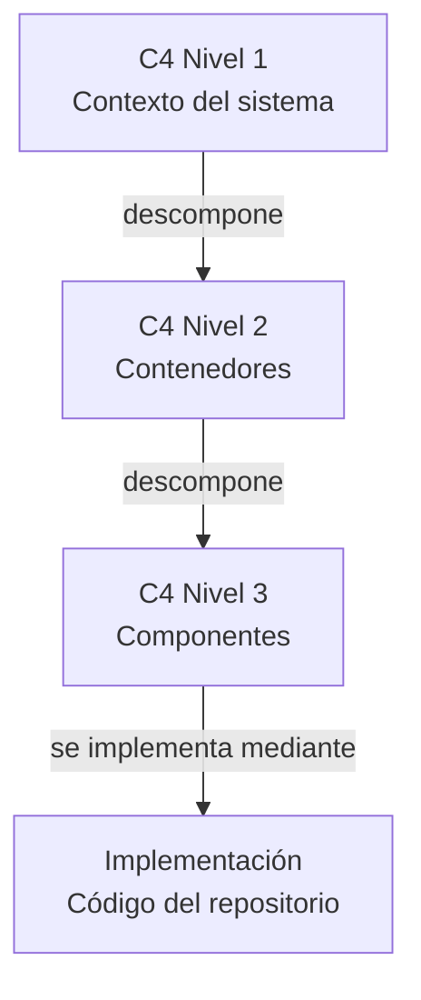
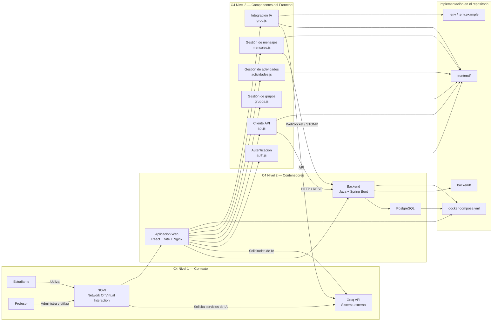
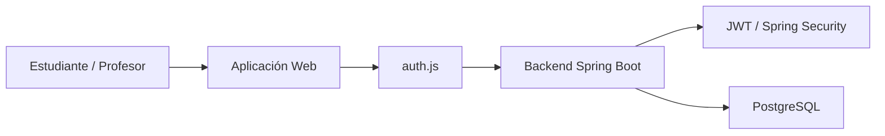
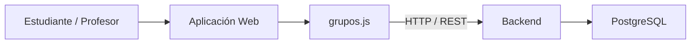
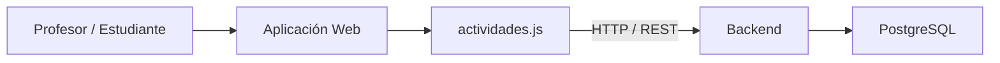
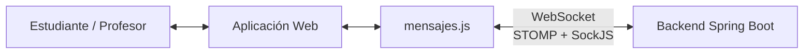
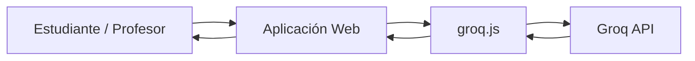
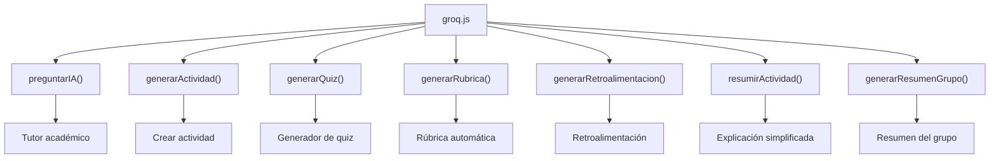
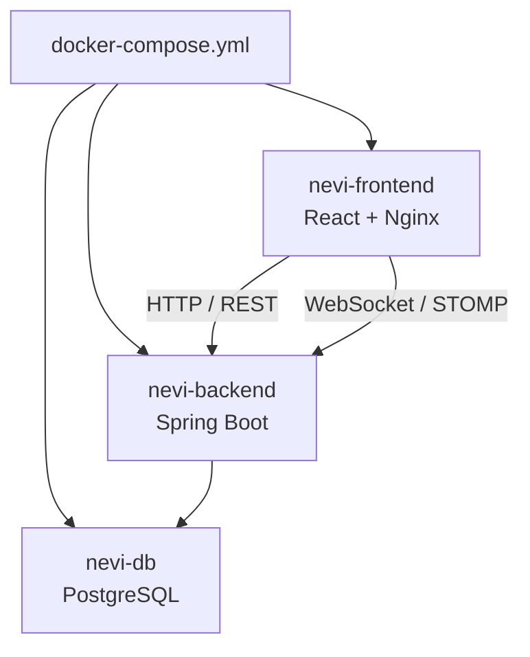
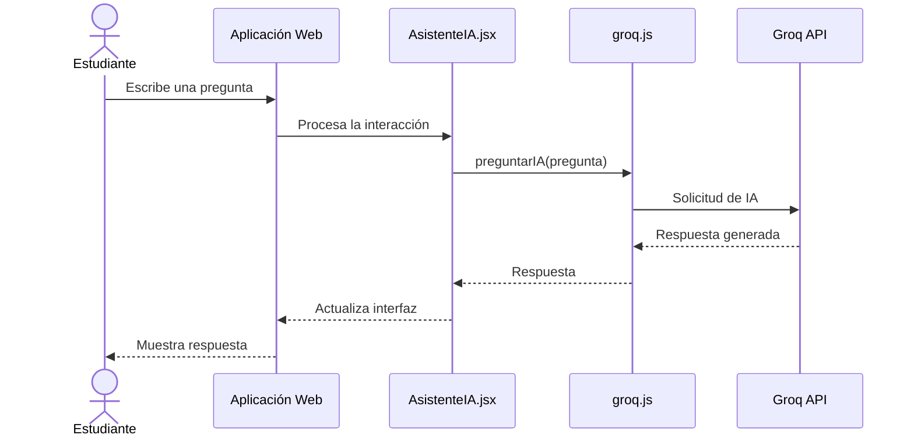

# Trazabilidad de Arquitectura C4 — NOVI

**Sistema:** NOVI — Network Of Virtual Interaction
**Repositorio:** `pinzon0930-boop/NEVI`
**Ubicación:** `dossier/04-trazabilidad-c4.md`

---

## 1. Objetivo

Este documento establece la trazabilidad entre los diferentes niveles del modelo **C4** utilizados para documentar la arquitectura de NOVI.

La trazabilidad permite relacionar:

* **C4 Nivel 1:** contexto general del sistema.
* **C4 Nivel 2:** contenedores principales.
* **C4 Nivel 3:** componentes internos de los contenedores.
* **Implementación:** archivos, servicios y tecnologías presentes en el repositorio.

El objetivo es comprobar que los elementos representados en los diagramas arquitectónicos mantienen correspondencia con la implementación real del proyecto.

---

# 2. Flujo general de trazabilidad



La relación general sigue el principio:

```text
Contexto
   ↓
Contenedores
   ↓
Componentes
   ↓
Implementación
```

---

# 3. Trazabilidad C4 completa



En este modelo:

* **WebSocket/STOMP** es un mecanismo de comunicación utilizado por el frontend y el backend.
* **Nginx** forma parte del contenedor de la aplicación web y sirve el build de React.
* **Docker Compose** define y ejecuta los servicios de la aplicación localmente.
* **Groq API** permanece como sistema externo.

---

# 4. Trazabilidad Nivel 1 → Nivel 2

El Nivel 1 representa NOVI desde una perspectiva externa, mientras que el Nivel 2 muestra los principales contenedores que conforman el sistema.

| C4 Nivel 1 | C4 Nivel 2     | Relación                                                        |
| ---------- | -------------- | --------------------------------------------------------------- |
| Estudiante | Aplicación Web | El estudiante utiliza la interfaz de NOVI                       |
| Profesor   | Aplicación Web | El profesor administra las funcionalidades mediante la interfaz |
| NOVI       | Aplicación Web | Contiene la interfaz de usuario del sistema                     |
| NOVI       | Backend        | Procesa las solicitudes y contiene la lógica de negocio         |
| NOVI       | PostgreSQL     | Almacena la información persistente del sistema                 |
| NOVI       | Groq API       | Utiliza servicios externos de inteligencia artificial           |

La implementación actual del repositorio separa `frontend`, `backend` y `docker-compose.yml`. El README también identifica React + Vite para el frontend, Spring Boot para el backend, PostgreSQL, WebSocket/STOMP, Groq API, Docker Compose y Nginx.

---

# 5. Trazabilidad Nivel 2 → Nivel 3

## 5.1 Aplicación Web

El contenedor **Aplicación Web** corresponde al frontend desarrollado con React y Vite.

Nginx se utiliza para servir el build del frontend cuando la aplicación se ejecuta mediante Docker.

### Componentes asociados

| C4 Nivel 2     | C4 Nivel 3             | Implementación                         |
| -------------- | ---------------------- | -------------------------------------- |
| Aplicación Web | Autenticación          | `frontend/src/services/auth.js`        |
| Aplicación Web | Cliente API            | `frontend/src/services/api.js`         |
| Aplicación Web | Gestión de grupos      | `frontend/src/services/grupos.js`      |
| Aplicación Web | Gestión de actividades | `frontend/src/services/actividades.js` |
| Aplicación Web | Gestión de mensajes    | `frontend/src/services/mensajes.js`    |
| Aplicación Web | Integración IA         | `frontend/src/services/groq.js`        |

Estos servicios aparecen dentro de `frontend/src/services/` en el repositorio.

---

# 6. Trazabilidad de autenticación



### Trazabilidad

```text
C4 Nivel 1
Estudiante / Profesor
        ↓
C4 Nivel 2
Aplicación Web
        ↓
C4 Nivel 3
Autenticación
        ↓
Implementación
frontend/src/services/auth.js
        ↓
Backend
Spring Security + JWT
        ↓
PostgreSQL
```

### Implementación

```text
frontend/
└── src/
    └── services/
        └── auth.js
```

El repositorio documenta el uso de **Spring Security + JWT** para la autenticación del sistema.

---

# 7. Trazabilidad de gestión de grupos



### Trazabilidad

```text
Nivel 1
Estudiante / Profesor
        ↓
Nivel 2
Aplicación Web
        ↓
Nivel 3
Gestión de grupos
        ↓
Implementación
frontend/src/services/grupos.js
        ↓
Backend
        ↓
PostgreSQL
```

Entre las funcionalidades documentadas se encuentra la creación y administración de grupos, así como el acceso mediante códigos de invitación.

---

# 8. Trazabilidad de gestión de actividades



### Trazabilidad

| Nivel          | Elemento                               |
| -------------- | -------------------------------------- |
| Nivel 1        | Profesor / Estudiante                  |
| Nivel 2        | Aplicación Web + Backend               |
| Nivel 3        | Gestión de actividades                 |
| Implementación | `frontend/src/services/actividades.js` |

Las funcionalidades documentadas incluyen la creación y consulta de actividades y la interacción de los estudiantes con las actividades disponibles.

---

# 9. Trazabilidad de comunicación en tiempo real

WebSocket no se representa como un contenedor independiente. Es un mecanismo de comunicación entre la aplicación web y el backend.



### Trazabilidad

```text
Nivel 1
Estudiante / Profesor
        ↓
Nivel 2
Aplicación Web
        ↓
Nivel 3
Gestión de mensajes
        ↓
Implementación
frontend/src/services/mensajes.js
        ↓
Comunicación
WebSocket / STOMP + SockJS
        ↓
Backend Spring Boot
```

El repositorio identifica WebSocket mediante STOMP y SockJS para la comunicación en tiempo real.

---

# 10. Trazabilidad de integración con inteligencia artificial



### Trazabilidad

| Nivel          | Elemento                        |
| -------------- | ------------------------------- |
| Nivel 1        | Groq API                        |
| Nivel 2        | Aplicación Web → Groq API       |
| Nivel 3        | Integración IA                  |
| Implementación | `frontend/src/services/groq.js` |

El repositorio identifica `groq.js` como el servicio principal utilizado para la integración con Groq.

### Funciones principales

```text
preguntarIA()
generarActividad()
generarQuiz()
generarRubrica()
generarRetroalimentacion()
resumirActividad()
generarResumenGrupo()
```

Estas funciones aparecen documentadas en el README del repositorio.

---

# 11. Trazabilidad de herramientas de IA



Estas funciones corresponden a las herramientas de IA descritas en el repositorio.

---

# 12. Trazabilidad de componentes visuales

Además de los servicios, las funcionalidades de IA están relacionadas con componentes React específicos.

| Funcionalidad            | Componente                   |
| ------------------------ | ---------------------------- |
| Tutor académico          | `AsistenteIA.jsx`            |
| Crear actividad con IA   | `CrearActividad.jsx`         |
| Generador de quiz        | `ModalQuiz.jsx`              |
| Generación de rúbricas   | `ModalRubrica.jsx`           |
| Retroalimentación        | `ModalRetroalimentacion.jsx` |
| Explicación simplificada | `ModalExplicacion.jsx`       |
| Resumen del grupo        | `GrupoDetalle.jsx`           |

El repositorio contiene estos componentes dentro de `frontend/src/components/` y `frontend/src/pages/`.

---

# 13. Trazabilidad de infraestructura y Docker

Docker Compose representa la forma en que se despliega localmente la arquitectura principal de NOVI.



### Implementación

| Elemento arquitectónico     | Implementación                  |
| --------------------------- | ------------------------------- |
| Aplicación Web              | `frontend/`                     |
| Backend                     | `backend/`                      |
| Base de datos               | PostgreSQL                      |
| Servidor web                | Nginx dentro de `nevi-frontend` |
| Orquestación local          | `docker-compose.yml`            |
| Comunicación en tiempo real | WebSocket / STOMP + SockJS      |
| IA externa                  | Groq API                        |

El README indica que `docker compose up --build` levanta tres contenedores principales:

```text
nevi-db
nevi-backend
nevi-frontend
```

El frontend es servido mediante Nginx dentro de `nevi-frontend`.

**Importante:** Docker Compose es una herramienta de despliegue y no un contenedor C4 adicional.

---

# 14. Trazabilidad del entorno local

La arquitectura principal de NOVI puede ejecutarse localmente mediante Docker Compose.

```text
                    ENTORNO LOCAL
                         │
                  Docker Compose
                         │
        ┌────────────────┼────────────────┐
        │                │                │
        ▼                ▼                ▼
   nevi-frontend    nevi-backend      nevi-db
   React + Nginx    Spring Boot      PostgreSQL
        │                │                │
        └───────┐        │        ┌───────┘
                │        │        │
                └────────┴────────┘

                         │
                         │ Internet
                         ▼

                    Groq API
                 Sistema externo
```

Por lo tanto:

* Frontend → local.
* Backend → local.
* PostgreSQL → local.
* Nginx → local, dentro del frontend.
* WebSocket/STOMP → ejecutado entre frontend y backend locales.
* Docker Compose → ejecutado localmente.
* Groq API → sistema externo.

La documentación del repositorio confirma que el stack principal puede levantarse mediante Docker Compose y que Groq requiere una clave de API externa.

---

# 15. Matriz general de trazabilidad

| ID    | Nivel C4 | Elemento                 | Implementación               | Estado |
| ----- | -------- | ------------------------ | ---------------------------- | ------ |
| C1-01 | Nivel 1  | Estudiante               | Usuario de NOVI              | ✅      |
| C1-02 | Nivel 1  | Profesor                 | Usuario de NOVI              | ✅      |
| C1-03 | Nivel 1  | NOVI                     | Sistema completo             | ✅      |
| C1-04 | Nivel 1  | Groq API                 | Sistema externo de IA        | ✅      |
| C2-01 | Nivel 2  | Aplicación Web           | `frontend/` + Nginx          | ✅      |
| C2-02 | Nivel 2  | Backend                  | `backend/`                   | ✅      |
| C2-03 | Nivel 2  | PostgreSQL               | `nevi-db`                    | ✅      |
| C2-04 | Nivel 2  | Groq API                 | API externa                  | ✅      |
| C3-01 | Nivel 3  | Autenticación            | `auth.js`                    | ✅      |
| C3-02 | Nivel 3  | Cliente API              | `api.js`                     | ✅      |
| C3-03 | Nivel 3  | Gestión de grupos        | `grupos.js`                  | ✅      |
| C3-04 | Nivel 3  | Gestión de actividades   | `actividades.js`             | ✅      |
| C3-05 | Nivel 3  | Gestión de mensajes      | `mensajes.js`                | ✅      |
| C3-06 | Nivel 3  | Integración IA           | `groq.js`                    | ✅      |
| C3-07 | Nivel 3  | Tutor académico          | `AsistenteIA.jsx`            | ✅      |
| C3-08 | Nivel 3  | Generador de actividades | `CrearActividad.jsx`         | ✅      |
| C3-09 | Nivel 3  | Generador de quizzes     | `ModalQuiz.jsx`              | ✅      |
| C3-10 | Nivel 3  | Generador de rúbricas    | `ModalRubrica.jsx`           | ✅      |
| C3-11 | Nivel 3  | Retroalimentación        | `ModalRetroalimentacion.jsx` | ✅      |
| C3-12 | Nivel 3  | Explicaciones            | `ModalExplicacion.jsx`       | ✅      |
| C3-13 | Nivel 3  | Resumen del grupo        | `GrupoDetalle.jsx`           | ✅      |

---

# 16. Relación entre documentación y código

La documentación C4 queda organizada de la siguiente manera:

```text
NEVI/
│
├── dossier/
│   ├── 01-contexto-sistema.md
│   ├── 02-nivel-2-contenedores.md
│   ├── 03-nivel-3-componentes.md
│   └── 04-trazabilidad-c4.md
│
├── frontend/
│   └── src/
│       ├── components/
│       ├── pages/
│       ├── services/
│       └── context/
│
├── backend/
│   └── src/
│       └── main/
│           ├── java/
│           │   └── com/
│           │       └── nevi/
│           └── resources/
│
├── docker-compose.yml
├── .env.example
└── README.md
```

La estructura del repositorio contiene actualmente `backend`, `frontend`, `dossier`, `docker-compose.yml` y `.env.example`.

---

# 17. Flujo completo de una solicitud de IA

Un ejemplo de trazabilidad completa es el uso del tutor académico.



### Trazabilidad

```text
C4 Nivel 1
Estudiante
    ↓
NOVI

C4 Nivel 2
Aplicación Web
    ↓
Integración con Groq API

C4 Nivel 3
AsistenteIA.jsx
    ↓
groq.js
    ↓
preguntarIA()

Sistema externo
    ↓
Groq API
```

---

# 18. Criterio de trazabilidad

Se considera que un elemento está correctamente trazado cuando puede establecerse una relación entre:

```text
Elemento del contexto
        ↓
Contenedor
        ↓
Componente
        ↓
Archivo / implementación
```

Por ejemplo:

```text
Profesor
   ↓
Aplicación Web
   ↓
Crear actividad
   ↓
CrearActividad.jsx
   ↓
groq.js
   ↓
Groq API
```

Otro ejemplo:

```text
Estudiante
   ↓
Aplicación Web
   ↓
Gestión de mensajes
   ↓
mensajes.js
   ↓
WebSocket / STOMP
   ↓
Backend Spring Boot
```

De esta forma, los diagramas C4 mantienen una relación directa con la implementación del sistema.

---

# 19. Conclusión

La arquitectura documentada de NOVI mantiene una relación entre los tres niveles del modelo C4 y la implementación del repositorio.

```text
┌──────────────────────────────┐
│ C4 NIVEL 1                   │
│ Contexto                     │
│                              │
│ Estudiante / Profesor        │
│          ↓                   │
│         NOVI                 │
│          ↓                   │
│       Groq API               │
└──────────────┬───────────────┘
               ↓
┌──────────────────────────────┐
│ C4 NIVEL 2                   │
│ Contenedores                 │
│                              │
│ Aplicación Web               │
│ Backend                      │
│ PostgreSQL                   │
│                              │
│ Groq API = externo           │
└──────────────┬───────────────┘
               ↓
┌──────────────────────────────┐
│ C4 NIVEL 3                   │
│ Componentes                  │
│                              │
│ auth.js                      │
│ api.js                       │
│ grupos.js                    │
│ actividades.js               │
│ mensajes.js                  │
│ groq.js                      │
│ Componentes React            │
└──────────────┬───────────────┘
               ↓
┌──────────────────────────────┐
│ IMPLEMENTACIÓN               │
│                              │
│ frontend/                    │
│ backend/                     │
│ docker-compose.yml           │
│ PostgreSQL                   │
│ Groq API                     │
└──────────────────────────────┘
```

La trazabilidad permite demostrar que la arquitectura propuesta para NOVI mantiene correspondencia con la estructura y las tecnologías presentes en el repositorio.

La separación queda definida de la siguiente manera:

```text
C4
│
├── Nivel 1 → ¿Quién utiliza el sistema?
│
├── Nivel 2 → ¿Qué contenedores forman el sistema?
│
├── Nivel 3 → ¿Qué componentes implementan esos contenedores?
│
└── Trazabilidad → ¿Dónde está implementado cada elemento?
```

El despliegue local mediante Docker Compose se mantiene como parte de la infraestructura de ejecución, mientras que **Groq API permanece como servicio externo**.
