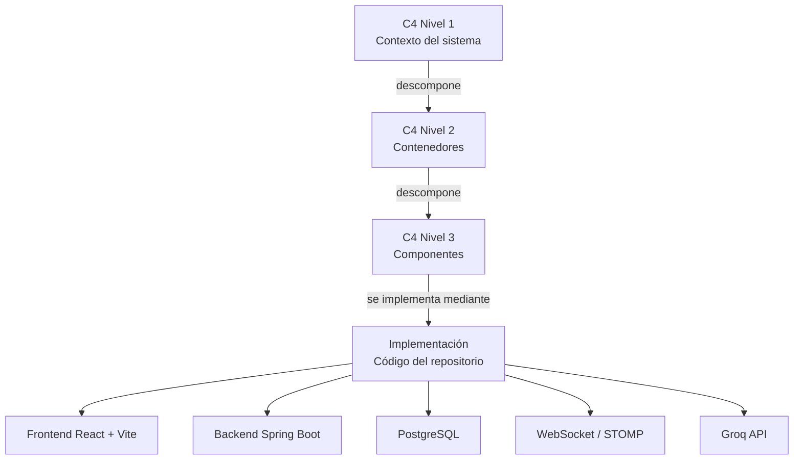
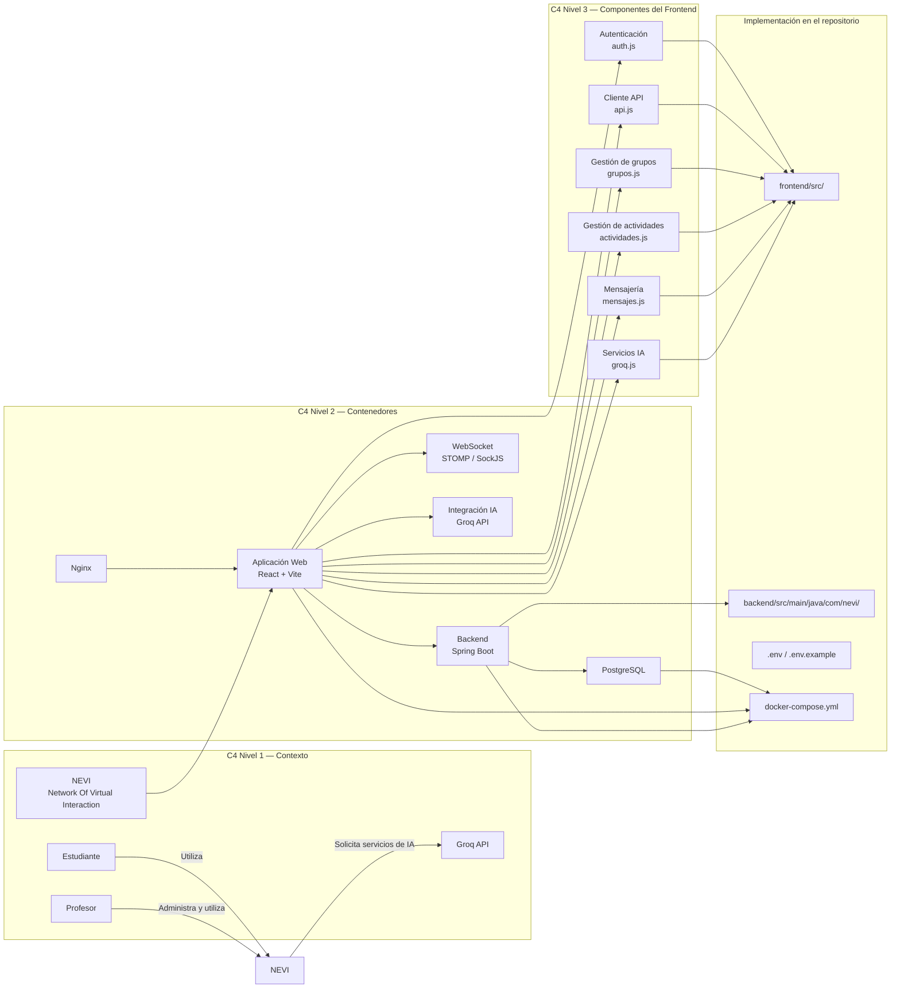
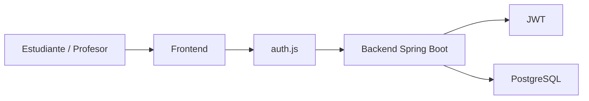
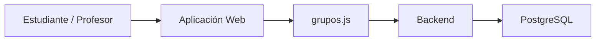
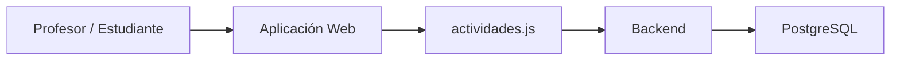
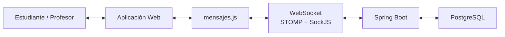
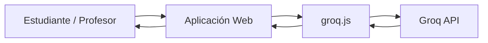
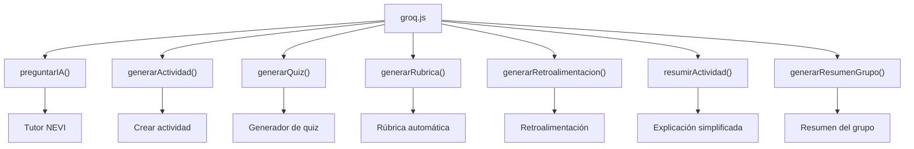
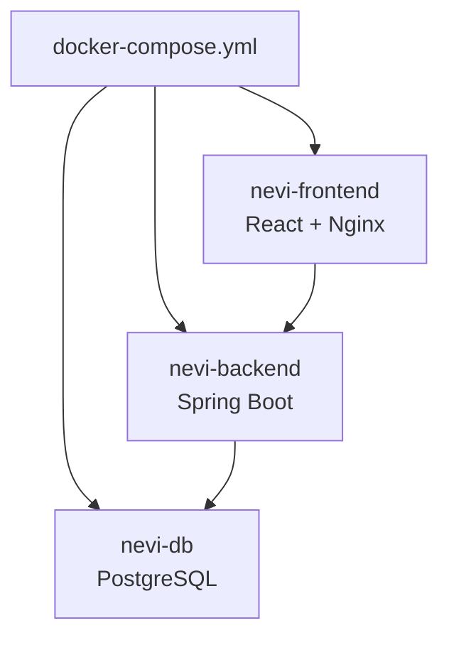
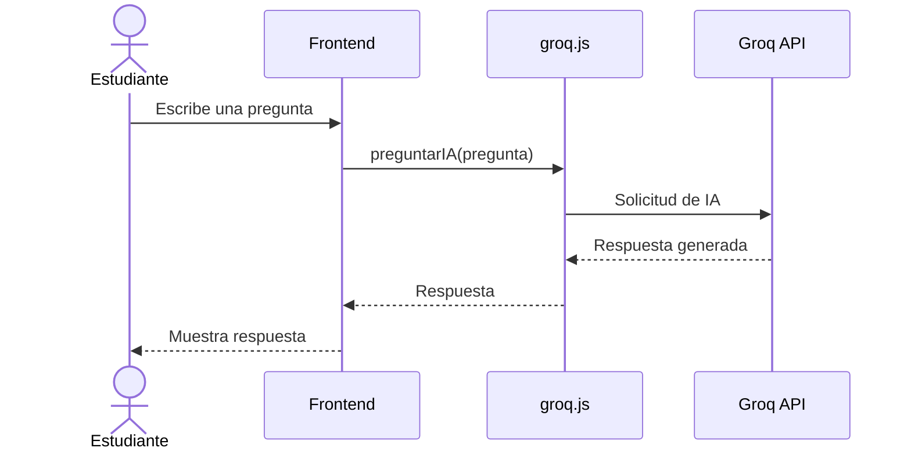

# Trazabilidad de Arquitectura C4 — NOVI

**Sistema:** NOVI — Network Of Virtual Interaction
**Repositorio:** `pinzon0930-boop/NEVI`
**Ubicación:** `dossier/04-trazabilidad-c4.md`

---

## 1. Objetivo

Este documento establece la trazabilidad entre los diferentes niveles del modelo **C4** utilizados para documentar la arquitectura de NOVI.

La trazabilidad permite relacionar:

* **C4 Nivel 1:** contexto general del sistema.
* **C4 Nivel 2:** contenedores principales.
* **C4 Nivel 3:** componentes internos de los contenedores.
* **Implementación:** archivos y servicios existentes en el repositorio.

El objetivo es comprobar que los elementos representados en los diagramas arquitectónicos corresponden con la implementación real del proyecto.

---

# 2. Flujo general de trazabilidad



---

# 3. Trazabilidad C4 completa



---

# 4. Trazabilidad Nivel 1 → Nivel 2

El Nivel 1 representa el sistema desde una perspectiva externa, mientras que el Nivel 2 muestra cómo NEVI se divide internamente en contenedores.

| C4 Nivel 1 | C4 Nivel 2     | Relación                                                     |
| ---------- | -------------- | ------------------------------------------------------------ |
| Estudiante | Aplicación Web | El estudiante utiliza la interfaz web                        |
| Profesor   | Aplicación Web | El profesor administra las funcionalidades desde la interfaz |
| NOVI       | Aplicación Web | Interfaz principal del sistema                               |
| NOVI       | Backend        | Procesamiento de solicitudes y lógica de negocio             |
| NOVI       | PostgreSQL     | Persistencia de información                                  |
| NOVI       | WebSocket      | Comunicación en tiempo real                                  |
| NOVI       | Groq API       | Funcionalidades de inteligencia artificial                   |

La estructura actual del repositorio confirma la separación entre `frontend`, `backend` y `docker-compose.yml`, además de la integración con PostgreSQL, WebSocket y Groq.

---

# 5. Trazabilidad Nivel 2 → Nivel 3

## 5.1 Aplicación Web

El contenedor **Aplicación Web** corresponde al frontend desarrollado con React y Vite.

### Componentes asociados

| C4 Nivel 2     | C4 Nivel 3             | Archivo                                |
| -------------- | ---------------------- | -------------------------------------- |
| Aplicación Web | Autenticación          | `frontend/src/services/auth.js`        |
| Aplicación Web | Cliente API            | `frontend/src/services/api.js`         |
| Aplicación Web | Gestión de grupos      | `frontend/src/services/grupos.js`      |
| Aplicación Web | Gestión de actividades | `frontend/src/services/actividades.js` |
| Aplicación Web | Mensajería             | `frontend/src/services/mensajes.js`    |
| Aplicación Web | Integración IA         | `frontend/src/services/groq.js`        |

Estos archivos aparecen actualmente dentro de `frontend/src/services/` del repositorio.

---

# 6. Trazabilidad de funcionalidades

## 6.1 Autenticación



### Implementación

**C4 Nivel 2:**

`Aplicación Web → Backend`

**C4 Nivel 3:**

`Componente de Autenticación → Cliente API → Backend`

**Código:**

```text
frontend/
└── src/
    └── services/
        └── auth.js
```

La autenticación utiliza **Spring Security + JWT**, de acuerdo con el stack documentado actualmente en el repositorio.

---

# 7. Gestión de grupos



### Trazabilidad

```text
Nivel 1
└── Estudiante / Profesor
        │
        ▼
Nivel 2
└── Aplicación Web
        │
        ▼
Nivel 3
└── Gestión de grupos
        │
        ▼
Implementación
└── frontend/src/services/grupos.js
```

Las funcionalidades documentadas incluyen creación de grupos y acceso mediante código de invitación.

---

# 8. Gestión de actividades



### Trazabilidad

| Nivel          | Elemento                               |
| -------------- | -------------------------------------- |
| Nivel 1        | Profesor / Estudiante                  |
| Nivel 2        | Aplicación Web + Backend               |
| Nivel 3        | Gestión de actividades                 |
| Implementación | `frontend/src/services/actividades.js` |

Entre las funciones documentadas del sistema se encuentran la creación y consulta de actividades, además de la entrega de actividades por parte de estudiantes.

---

# 9. Comunicación en tiempo real



### Trazabilidad

```text
Nivel 1
└── Estudiante / Profesor
        │
        ▼
Nivel 2
└── Aplicación Web
        │
        └── WebSocket
                │
                ▼
Nivel 3
└── Gestión de mensajes
        │
        ▼
Implementación
└── frontend/src/services/mensajes.js
```

El repositorio documenta el uso de **WebSocket con STOMP y SockJS** para la comunicación en tiempo real.

---

# 10. Integración con inteligencia artificial



### Trazabilidad

| Nivel          | Elemento                        |
| -------------- | ------------------------------- |
| Nivel 1        | Groq API                        |
| Nivel 2        | Integración IA                  |
| Nivel 3        | Servicios de IA                 |
| Implementación | `frontend/src/services/groq.js` |

El archivo `groq.js` concentra las funciones utilizadas para las diferentes herramientas de IA. El repositorio documenta funciones para tutor académico, generación de actividades, quizzes, rúbricas, retroalimentación y explicaciones simplificadas.

### Funciones principales

```text
preguntarIA()
generarActividad()
generarQuiz()
generarRubrica()
generarRetroalimentacion()
resumirActividad()
generarResumenGrupo()
```

---

# 11. Trazabilidad de las herramientas de IA



El repositorio identifica estas funcionalidades de IA y las relaciona con componentes concretos del frontend.

---

# 12. Trazabilidad de componentes visuales

Además de los servicios, las funcionalidades de IA están conectadas con componentes React específicos.

| Funcionalidad            | Componente                   |
| ------------------------ | ---------------------------- |
| Tutor académico          | `AsistenteIA.jsx`            |
| Crear actividad con IA   | `CrearActividad.jsx`         |
| Generador de quiz        | `ModalQuiz.jsx`              |
| Generación de rúbricas   | `ModalRubrica.jsx`           |
| Retroalimentación        | `ModalRetroalimentacion.jsx` |
| Explicación simplificada | `ModalExplicacion.jsx`       |
| Resumen del grupo        | `GrupoDetalle.jsx`           |

Estos componentes forman parte de `frontend/src/components/` y `frontend/src/pages/` del repositorio.

---

# 13. Trazabilidad de infraestructura



### Implementación

| Elemento C4            | Implementación       |
| ---------------------- | -------------------- |
| Frontend               | `frontend/`          |
| Backend                | `backend/`           |
| Base de datos          | PostgreSQL           |
| Frontend en producción | Nginx                |
| Orquestación           | `docker-compose.yml` |

El README del repositorio indica que Docker Compose levanta los tres contenedores principales: `nevi-db`, `nevi-backend` y `nevi-frontend`.

---

# 14. Matriz general de trazabilidad

| ID    | Nivel C4 | Elemento                 | Implementación               | Estado |
| ----- | -------- | ------------------------ | ---------------------------- | ------ |
| C1-01 | Nivel 1  | Estudiante               | Usuario de NEVI              | ✅      |
| C1-02 | Nivel 1  | Profesor                 | Usuario de NEVI              | ✅      |
| C1-03 | Nivel 1  | NOVI                     | Sistema completo             | ✅      |
| C1-04 | Nivel 1  | Groq API                 | Servicio externo de IA       | ✅      |
| C2-01 | Nivel 2  | Aplicación Web           | `frontend/`                  | ✅      |
| C2-02 | Nivel 2  | Backend                  | `backend/`                   | ✅      |
| C2-03 | Nivel 2  | PostgreSQL               | Contenedor `nevi-db`         | ✅      |
| C2-04 | Nivel 2  | WebSocket                | STOMP + SockJS               | ✅      |
| C2-05 | Nivel 2  | Groq API                 | Integración IA               | ✅      |
| C2-06 | Nivel 2  | Nginx                    | Servidor del frontend        | ✅      |
| C3-01 | Nivel 3  | Autenticación            | `auth.js`                    | ✅      |
| C3-02 | Nivel 3  | Cliente API              | `api.js`                     | ✅      |
| C3-03 | Nivel 3  | Gestión de grupos        | `grupos.js`                  | ✅      |
| C3-04 | Nivel 3  | Gestión de actividades   | `actividades.js`             | ✅      |
| C3-05 | Nivel 3  | Mensajería               | `mensajes.js`                | ✅      |
| C3-06 | Nivel 3  | Integración IA           | `groq.js`                    | ✅      |
| C3-07 | Nivel 3  | Tutor NEVI               | `AsistenteIA.jsx`            | ✅      |
| C3-08 | Nivel 3  | Generador de actividades | `CrearActividad.jsx`         | ✅      |
| C3-09 | Nivel 3  | Generador de quizzes     | `ModalQuiz.jsx`              | ✅      |
| C3-10 | Nivel 3  | Generador de rúbricas    | `ModalRubrica.jsx`           | ✅      |
| C3-11 | Nivel 3  | Retroalimentación        | `ModalRetroalimentacion.jsx` | ✅      |
| C3-12 | Nivel 3  | Explicaciones            | `ModalExplicacion.jsx`       | ✅      |
| C3-13 | Nivel 3  | Resumen del grupo        | `GrupoDetalle.jsx`           | ✅      |

---

# 15. Relación entre documentación y código

La documentación C4 queda organizada de la siguiente manera:

```text
NEVI/
│
├── dossier/
│   ├── 01-contexto-sistema.md
│   ├── 02-nivel-2-contenedores.md
│   ├── 03-nivel-3-componentes.md
│   └── 04-trazabilidad-c4.md
│
├── frontend/
│   └── src/
│       ├── components/
│       ├── pages/
│       ├── services/
│       └── context/
│
├── backend/
│   └── src/
│       └── main/
│           ├── java/
│           │   └── com/nevi/
│           └── resources/
│
├── docker-compose.yml
└── README.md
```

La estructura real del repositorio contiene actualmente `backend`, `frontend`, `dossier` y `docker-compose.yml`, por lo que la trazabilidad puede mantenerse dentro de la carpeta `dossier`.

---

# 16. Flujo completo de una solicitud

Un ejemplo de trazabilidad completa sería el uso del **Tutor NEVI**:



La trazabilidad sería:

```text
C4 Nivel 1
Estudiante
    ↓
NEVI

C4 Nivel 2
Aplicación Web
    ↓
Integración IA

C4 Nivel 3
AsistenteIA.jsx
    ↓
groq.js
    ↓
preguntarIA()

Sistema externo
    ↓
Groq API
```

---

# 17. Criterio de trazabilidad

Se considera que un elemento está trazado cuando puede establecerse la siguiente relación:

```text
Elemento del contexto
        ↓
Contenedor
        ↓
Componente
        ↓
Archivo / implementación
```

Por ejemplo:

```text
Profesor
   ↓
Aplicación Web
   ↓
Crear actividad
   ↓
CrearActividad.jsx
   ↓
groq.js
   ↓
Groq API
```

De esta forma, los diagramas C4 no representan elementos aislados, sino que mantienen una relación con la implementación del sistema.

---

# 18. Conclusión

La arquitectura documentada de NOVI mantiene una relación entre los tres niveles C4:

```text
┌──────────────────────────────┐
│ C4 NIVEL 1                   │
│ Contexto                     │
│                              │
│ Estudiante / Profesor        │
│          ↓                   │
│         NOVI                 │
│          ↓                   │
│       Groq API               │
└──────────────┬───────────────┘
               ↓
┌──────────────────────────────┐
│ C4 NIVEL 2                   │
│ Contenedores                 │
│                              │
│ Frontend                     │
│ Backend                      │
│ PostgreSQL                   │
│ WebSocket                    │
│ Groq API                     │
│ Nginx                        │
└──────────────┬───────────────┘
               ↓
┌──────────────────────────────┐
│ C4 NIVEL 3                   │
│ Componentes                  │
│                              │
│ auth.js                      │
│ api.js                       │
│ grupos.js                    │
│ actividades.js               │
│ mensajes.js                  │
│ groq.js                      │
│ Componentes React            │
└──────────────┬───────────────┘
               ↓
┌──────────────────────────────┐
│ IMPLEMENTACIÓN               │
│                              │
│ frontend/                    │
│ backend/                     │
│ docker-compose.yml           │
│ PostgreSQL                   │
│ Groq API                     │
└──────────────────────────────┘
```

La trazabilidad permite demostrar que la arquitectura propuesta para NEVI corresponde con la estructura y las tecnologías presentes en el repositorio, manteniendo una relación clara entre **contexto, contenedores, componentes y código**.
